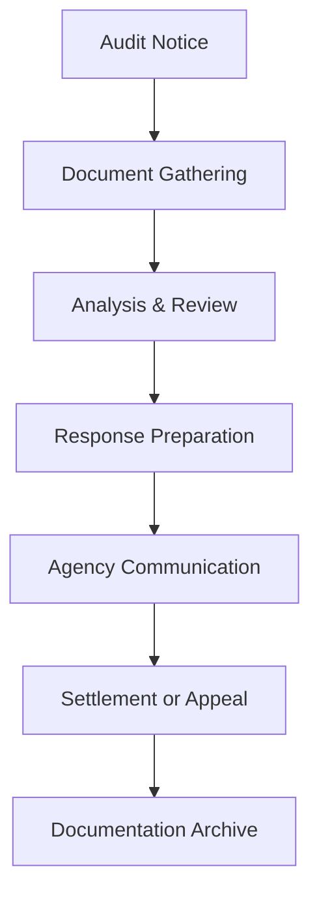

**Category:** Sales Tax & Indirect Tax
**Difficulty:** Intermediate
**Reading time:** 6 min read

---

Sales tax audit support systems provide tools and documentation to help businesses respond to tax audits and inquiries from revenue authorities. These platforms organize transaction records, generate audit reports, and track correspondence with tax agencies.

- **Audit Trail** — complete record of all tax calculations and payments
- **Documentation** — supporting evidence for tax filings and claims
- **Correspondence Management** — tracking communications with tax authorities
- **Remediation** — correcting identified issues and filing amended returns
- **Dispute Resolution** — formal processes for challenging audit findings

When an audit is initiated, audit support systems help organize and retrieve required documentation from transaction records, tax filings, and payment confirmations. The platform analyzes audit findings against historical records to identify discrepancies or calculation errors. It generates comprehensive audit response documents with supporting schedules and explanations. The system tracks all correspondence with tax authorities, maintains timelines for responses, and alerts users to critical deadlines. For disputes, it facilitates appeals processes and maintains documentation for litigation. Systems often include analysis tools to identify audit risk areas and recommend preventative measures for future periods.

- Responding to tax authority inquiries and audit notices
- Organizing documentation for audit defense
- Identifying and correcting tax calculation errors
- Tracking audit timelines and compliance requirements
- Generating comprehensive audit response reports

| Advantage | Disadvantage |
|-----------|--------------|
| Organized documentation | Requires detailed historical records |
| Faster audit response | Expert consultation may be needed |
| Reduced audit risk | Time-consuming to prepare responses |
| Audit prevention insights | Not all findings are defensible |
| Complete audit trail | Legal fees for appeals |

- [Sales tax filing automation](sales-tax-filing-automation.md)
- [Reverse sales tax calculation](reverse-sales-tax-calculation.md)
- [Cross-border tax compliance](cross-border-tax-compliance.md)

---
*Part of the [Sales Tax & Indirect Tax](sales-tax-indirect-tax/index.md) category · [Back to Master Index](../../index.md)*
