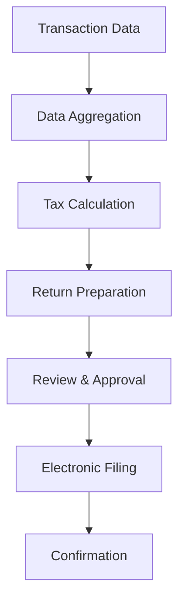

**Category:** Sales Tax & Indirect Tax
**Difficulty:** Intermediate
**Reading time:** 6 min read

---

Sales tax filing automation uses software and workflows to streamline the preparation and submission of sales tax returns. These systems collect transaction data, calculate tax obligations, and facilitate timely filing across multiple jurisdictions.

- **Return Filing** — submission of tax liability calculations to tax authorities
- **Tax Obligation** — calculated amount of tax owed based on transactions
- **Data Aggregation** — collecting sales data from multiple sources and systems
- **Workflow Automation** — automated steps to prepare and submit filings
- **E-filing** — electronic submission of tax documents to government systems

Filing automation software integrates with point-of-sale systems, accounting software, and payment processors to gather transaction data. The system calculates tax liability based on the aggregated data and applicable rates for each jurisdiction. It then generates return documents with required fields, supporting schedules, and worksheets. Built-in workflows route filings for review and approval before electronic submission to tax authorities. The system tracks filing deadlines, maintains audit trails, and stores confirmation receipts from agencies. Many platforms support multi-jurisdiction filing, handling different report formats and requirements across states and localities.

- Monthly or quarterly sales tax return preparation
- Multi-state business tax compliance
- Reducing time spent on manual return preparation
- Improving filing accuracy and reducing penalties
- Maintaining compliance documentation for audits

| Advantage | Disadvantage |
|-----------|--------------|
| Faster return preparation | Upfront software investment |
| Reduced filing errors | Requires clean transaction data |
| Automated deadline tracking | Learning curve for setup |
| Audit-ready documentation | Not all jurisdictions e-filing ready |
| Multi-jurisdiction support | API integration complexity |

- [Sales tax rate databases](sales-tax-rate-databases.md)
- [Sales tax payment scheduling](sales-tax-payment-scheduling.md)
- [Sales tax audit support](sales-tax-audit-support.md)

---
*Part of the [Sales Tax & Indirect Tax](sales-tax-indirect-tax/index.md) category · [Back to Master Index](../../index.md)*
