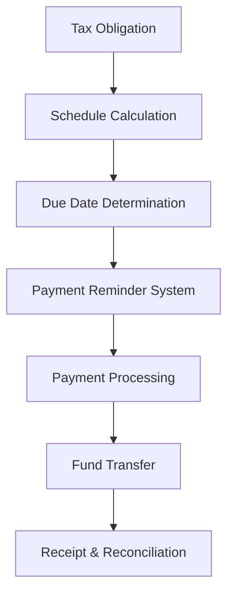

**Category:** Sales Tax & Indirect Tax
**Difficulty:** Intermediate
**Reading time:** 6 min read

---

Sales tax payment scheduling involves organizing and timing tax payments to meet regulatory deadlines while optimizing cash flow. These systems track payment due dates, calculate required payment amounts, and manage payment submission across multiple jurisdictions.

- **Payment Schedule** — timeline of when tax payments are due
- **Payment Frequency** — how often taxes must be paid (monthly, quarterly, annually)
- **Remittance** — actual transfer of tax funds to government agencies
- **Penalty Prevention** — avoiding late payment fees through timely submission
- **Cash Flow Management** — aligning payment obligations with available funds

Payment scheduling systems analyze tax liability calculations and applicable payment deadlines for each jurisdiction. The system creates a calendar of upcoming payment obligations, often with reminders before due dates. It calculates exact payment amounts based on reported tax liabilities and may include provisions for estimated payments based on historical trends. The platform facilitates payment through bank transfers, credit cards, or government portals. It tracks payment status, stores confirmation numbers, and reconciles payments against filings. Advanced systems support multi-currency payments and handle timezone differences across jurisdictions.

- Planning cash flow around tax payment obligations
- Meeting mandatory payment deadlines across states
- Reducing manual tracking of multiple due dates
- Preventing penalties from late or missed payments
- Creating audit trails for payment compliance

| Advantage | Disadvantage |
|-----------|--------------|
| Automated deadline tracking | Requires accurate liability calculations |
| Reduces payment penalties | Payment processing fees |
| Improves cash flow visibility | Limited integration with some banks |
| Multi-jurisdiction support | Timing delays in some jurisdictions |
| Comprehensive audit trail | Initial setup complexity |

- [Sales tax filing automation](sales-tax-filing-automation.md)
- [Sales tax audit support](sales-tax-audit-support.md)
- [Use tax compliance](use-tax-compliance.md)

---
*Part of the [Sales Tax & Indirect Tax](sales-tax-indirect-tax/index.md) category · [Back to Master Index](../../index.md)*
