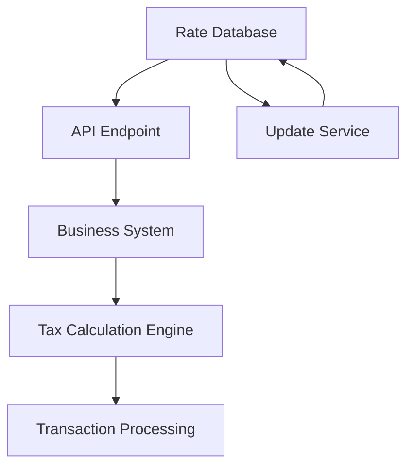

**Category:** Sales Tax & Indirect Tax
**Difficulty:** Intermediate
**Reading time:** 6 min read

---

Sales tax rate databases are centralized repositories containing current tax rates, jurisdictions, and regulatory information across multiple territories. These systems automatically update rates and help businesses apply correct taxes to transactions.

- **Tax Jurisdiction** — geographic area with specific sales tax rules and rates
- **Tax Nexus** — connection between business and location requiring tax collection
- **Combined Rate** — sum of state, county, and local sales tax percentages
- **Effective Date** — when a tax rate change takes effect
- **Database Synchronization** — real-time updates to rate information across systems

Sales tax rate databases maintain comprehensive lookup tables indexed by postal codes, counties, cities, and special tax districts. When a transaction occurs, the system queries the database using the customer's location to retrieve the applicable rate. The database continuously updates to reflect new rates, rule changes, and jurisdictional changes. Modern databases use geolocation data to pinpoint exact tax jurisdictions and handle complex scenarios where multiple overlapping jurisdictions apply. The system typically maintains historical rate information for audit purposes and provides rate-effective-date tracking to ensure accurate calculations for transactions processed on specific dates.

- Automated calculation of sales tax during e-commerce checkout
- Ensuring compliance across multi-state sales operations
- Reducing manual rate lookup and update processes
- Providing audit trails with accurate historical rates
- Integrating with accounting and ERP systems

| Advantage | Disadvantage |
|-----------|--------------|
| Real-time rate accuracy | API dependency and latency |
| Reduced compliance risk | Subscription costs for premium data |
| Automated updates | Data quality varies by provider |
| Historical rate tracking | Integration complexity |
| Multi-jurisdiction support | Learning curve for configuration |

- [Sales tax filing automation](sales-tax-filing-automation.md)
- [Sales tax payment scheduling](sales-tax-payment-scheduling.md)
- [Cross-border tax compliance](cross-border-tax-compliance.md)

---
*Part of the [Sales Tax & Indirect Tax](sales-tax-indirect-tax/index.md) category · [Back to Master Index](../../index.md)*
