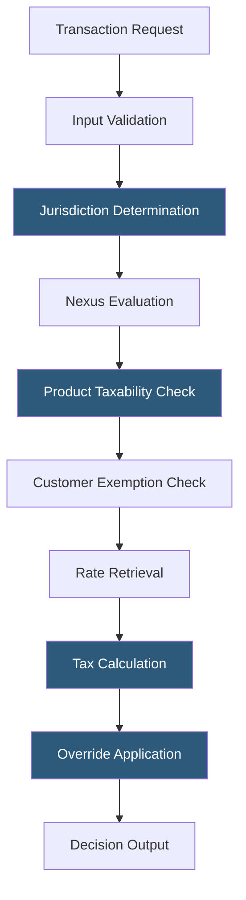

**Category:** Sales Tax & Indirect Tax
**Difficulty:** Advanced
**Reading time:** 6 min read

---

The Sovos Determination Engine is the core tax calculation component of the Sovos platform, applying complex indirect tax rules across transactions to produce accurate tax decisions. It handles multi-jurisdictional US sales tax, VAT, GST, and country-specific indirect taxes using Sovos's maintained compliance data network and a high-performance processing architecture designed for enterprise transaction volumes.

- **Tax Logic Hierarchy** — the layered rule system: statutory rules (from legislation) → industry rules → company-specific overrides
- **Transaction Partitioning** — breaking complex transactions with multiple ship-from or ship-to locations into sub-transactions for accurate taxation
- **Product Mapping** — the process of mapping internal product codes/SKUs to Sovos tax categories for correct taxability determination
- **Buyer Entity Type** — classification of the customer (consumer, reseller, manufacturer, government) affecting applicable exemptions
- **Multi-Currency Tax** — calculating tax in the transaction currency while reporting in functional currency with appropriate exchange rates
- **Prospective vs. Retroactive** — handling both future transactions (prospective) and correcting historical transactions (retroactive) within the engine
- **Decision Cache** — a performance optimization caching tax decisions for identical transaction parameters to reduce recalculation overhead

The Sovos Determination Engine processes each transaction through a sequential decision pipeline. Input validation confirms the request contains required fields (addresses, amounts, product identifiers). Jurisdiction determination resolves addresses to taxing authorities using Sovos's geolocation database, with US addresses resolving to state, county, city, and special district levels.

Nexus evaluation checks the company's configured nexus positions—physical presence nexus from registered locations and economic nexus from accumulated sales thresholds. Only jurisdictions where nexus exists generate tax obligations; others pass through without taxation.

Product taxability determination is the most complex step. Sovos's compliance data network contains taxability matrix entries for thousands of product category / jurisdiction combinations, capturing legislative nuances like New York's clothing exemption below $110 or Texas's software-as-a-service partial taxability rules. The engine evaluates the product's mapped Sovos tax category against each applicable jurisdiction's rules.

Customer exemption evaluation checks whether the buyer entity type or a specific exemption certificate on file qualifies for reduced or zero tax in any jurisdiction. Rate retrieval pulls the current rates from the compliance database, and the calculation multiplies taxable amounts by rates. Company-configured overrides apply final adjustments for scenarios the standard rules don't cover.

- Enterprise ERP integration requiring high-reliability tax decisions at millions of transactions per month
- Global transactions requiring consistent treatment across US, EU, and APAC jurisdictions
- Complex B2B transactions with partial exemptions across multiple line items
- Retroactive tax correction processing for prior period adjustments
- Organizations needing audit-ready decision audit trails with full rule documentation

| Advantage | Disadvantage |
|-----------|--------------|
| Global tax coverage in a single engine | Significant implementation effort for complex product mappings |
| High-performance caching for repeated transaction patterns | Sovos content depth varies by region outside core US/EU markets |
| Complete decision audit trail for every transaction | Implementation requires Sovos professional services engagement |
| Tax logic hierarchy enables company-specific customization | Pricing model not transparent; requires enterprise negotiation |

- [Sovos S1 Sales & Use Tax](sovos-s1-sales-use-tax.md)
- [Vertex Sales Tax O Series](vertex-sales-tax-o-series.md)
- [Tax Jurisdiction Determination](tax-jurisdiction-determination.md)

---
*Part of the [Sales Tax & Indirect Tax](index.md) category · [Back to Master Index](../../index.md)*
