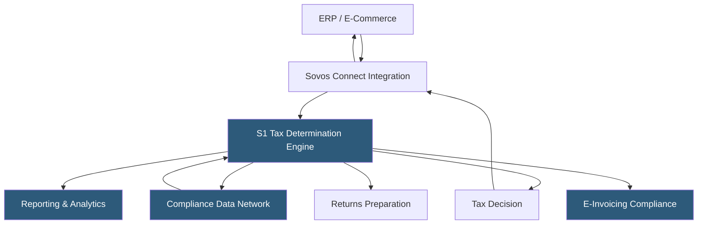

**Category:** Sales Tax & Indirect Tax
**Difficulty:** Advanced
**Reading time:** 6 min read

---

Sovos S1 is an enterprise sales and use tax compliance platform combining tax determination, e-invoicing, returns, and reporting in a unified cloud environment. Sovos positions itself as a global tax compliance platform, providing a single system for businesses managing indirect tax obligations across US sales tax, EU VAT, Latin American e-invoicing, and other international regimes.

- **Tax Determination Engine** — the core calculation component determining tax liability for each transaction
- **Compliance Data Network** — Sovos's maintained database of tax rules, rates, and jurisdictions across 60+ countries
- **E-Invoicing Compliance** — Sovos's capability for countries requiring real-time or near-real-time invoice reporting to government authorities
- **Reporting & Insights** — analytics layer providing tax liability visualization and anomaly detection across the compliance data
- **Sovos Connect** — integration middleware linking ERP and e-commerce platforms to the Sovos platform
- **Indirect Tax Suite** — the combined package of determination, returns, and e-invoicing under one Sovos subscription
- **Government Monitoring** — Sovos's service tracking global e-invoicing mandate changes and updating compliance logic accordingly

Sovos S1 processes tax determination requests through its cloud API. Transaction data flows from ERP or billing systems via Sovos Connect integration adapters certified for SAP, Oracle, Microsoft Dynamics, and custom REST API connections. The determination engine evaluates each transaction using the Compliance Data Network—Sovos's content database maintained by a global network of local tax experts who track legislative changes in each jurisdiction.

For US sales and use tax, the engine handles the same jurisdiction-based calculation as competitors with its own content depth emphasis. Where Sovos differentiates is in global coverage: the same platform handles Brazilian NF-e (electronic invoice) generation and validation required by Brazilian law, European VAT real-time reporting mandates (e.g., Italy's SDI, Spain's SII), and US sales tax simultaneously.

The e-invoicing compliance module manages countries requiring businesses to submit invoice data to government clearance or reporting systems in real time or near real time. Sovos's government monitoring team tracks mandate changes globally—as countries increasingly adopt continuous transaction controls (CTC) e-invoicing—and updates platform compliance logic before effective dates.

Returns automation generates and submits returns in supported jurisdictions, pulling from the determination transaction log as the data source.

- Global enterprises needing a single platform for US sales tax and international VAT
- Companies operating in Latin America requiring e-invoicing compliance
- Large corporations replacing multiple point solutions with a unified indirect tax stack
- Finance teams managing EU VAT OSS reporting obligations
- Organizations subject to growing e-invoicing mandates in multiple countries

| Advantage | Disadvantage |
|-----------|--------------|
| Single platform for global indirect tax reduces vendor count | Enterprise pricing and implementation cost is very significant |
| E-invoicing compliance for Latin America and Europe built-in | Implementation complexity requires dedicated Sovos project team |
| Global tax research team maintains content in 60+ countries | Less widely deployed than Avalara in US mid-market |
| Anomaly detection identifies potential compliance issues | Platform breadth can overwhelm organizations needing only US tax |

- [Sovos Determination Engine](sovos-determination-engine.md)
- [Vertex Sales Tax O Series](vertex-sales-tax-o-series.md)
- [EU VAT Compliance](eu-vat-compliance.md)

---
*Part of the [Sales Tax & Indirect Tax](index.md) category · [Back to Master Index](../../index.md)*
