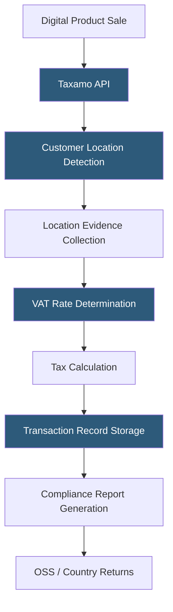

**Category:** Sales Tax & Indirect Tax
**Difficulty:** Intermediate
**Reading time:** 6 min read

---

Taxamo (now part of Vertex) is a VAT and digital services tax compliance platform designed for businesses selling digital goods and services to consumers globally. It handles EU VAT, UK VAT, Australian GST, and other jurisdictions' digital services tax rules, automating the determination, calculation, and compliance reporting for B2C digital transactions.

- **B2C Digital Services Tax** — VAT or GST applied to digital goods (e-books, streaming, software downloads) sold to consumers in the buyer's country
- **Customer Location Evidence** — the requirement to collect and store two non-conflicting pieces of evidence (IP address, bank country, billing address) confirming a B2C customer's location for EU VAT
- **EU VAT OSS** — One Stop Shop, the EU's simplified system allowing businesses to file a single quarterly return covering all EU member state VAT
- **Digital Services Tax (DST)** — country-level taxes on digital platform revenues (UK DST, French DST), separate from VAT
- **B2C Threshold** — country-specific revenue thresholds below which foreign sellers may not need to register for VAT (EU has a €10,000 OSS threshold)
- **Tax Record** — Taxamo's transaction-level record including all required audit fields (customer location evidence, tax calculation details)
- **Compliance Report** — aggregated data formatted for OSS/MOSS return filing

Taxamo's API accepts digital transaction details and applies the customer's country VAT rules. Determining the customer's country requires collecting location evidence: EU VAT rules mandate two pieces of non-conflicting evidence for B2C sales (e.g., IP geolocation matching a billing country or a declared country matching a phone prefix). Taxamo automates this evidence collection and stores the evidence alongside each transaction record for the 10-year audit retention period EU law requires.

VAT rate determination applies the customer's country rate for the specific digital product category. EU member states set their own VAT rates (standard rates range from 17% in Luxembourg to 27% in Hungary), and some countries apply reduced rates to certain digital products (e-books and newspapers qualify for reduced rates in many EU states after 2015 legislative changes).

Transaction records store in Taxamo's cloud database with all required compliance fields. Compliance reports aggregate these records into the format required for EU OSS quarterly returns—showing total sales and VAT collected by member state. Taxamo generates these reports for download, and some integrations submit them directly to the member state's OSS portal.

The platform handles non-EU jurisdictions including UK VAT (post-Brexit, now a separate registration from EU), Australian GST on digital services, Norway VAT, and other countries adopting similar digital services tax frameworks.

- SaaS companies selling to EU consumers needing OSS compliance
- Digital content platforms (e-books, streaming, downloads) managing B2C VAT
- App stores and marketplace sellers of digital goods to global consumers
- Subscription software companies with significant EU consumer customer bases
- EdTech and media platforms needing automated location-based VAT

| Advantage | Disadvantage |
|-----------|--------------|
| EU VAT B2C expertise and location evidence automation | Primarily B2C focused; B2B EU VAT reverse charge less emphasized |
| 10-year transaction record retention for audit readiness | Post-Vertex acquisition integration may affect platform direction |
| OSS-ready reporting reduces quarterly compliance burden | Limited US sales tax capabilities; specialists for EU VAT |
| Handles location evidence automatically per EU requirements | Coverage of non-EU jurisdictions narrower than global platforms |

- [EU VAT Compliance](eu-vat-compliance.md)
- [VAT OSS (One Stop Shop)](vat-oss-one-stop-shop.md)
- [Digital Services Tax (DST)](digital-services-tax-dst.md)

---
*Part of the [Sales Tax & Indirect Tax](index.md) category · [Back to Master Index](../../index.md)*
