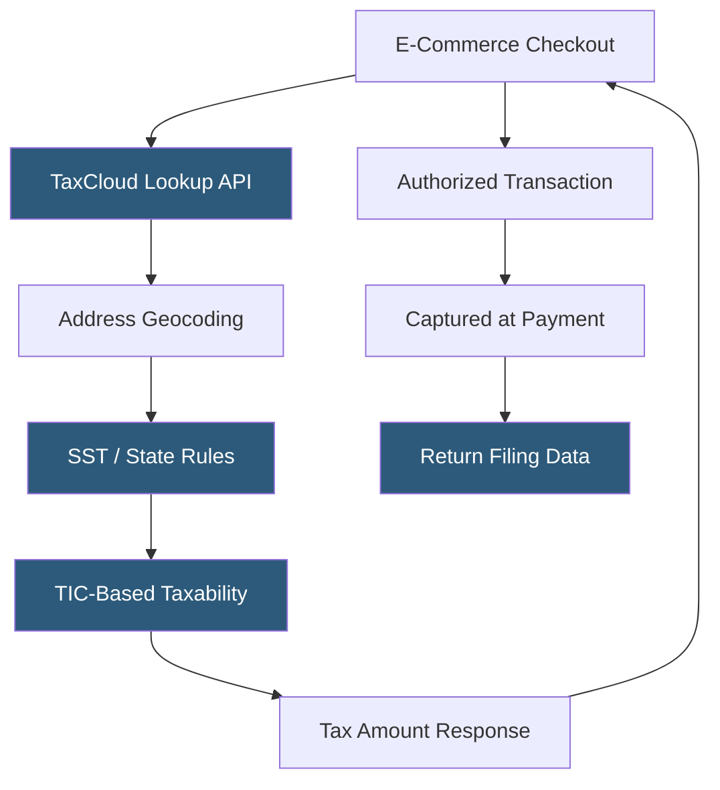

**Category:** Sales Tax & Indirect Tax
**Difficulty:** Beginner
**Reading time:** 5 min read

---

TaxCloud is a free-to-use (for most US merchants) sales tax compliance service funded by state government contracts, providing real-time sales tax calculation, registration assistance, and return filing for e-commerce businesses. It is a member of the Streamlined Sales Tax (SST) program, enabling simplified compliance in SST member states.

- **Streamlined Sales Tax (SST)** — a multi-state simplification initiative that standardizes tax definitions and rules across member states, currently 24 states
- **SST Certified Service Provider (CSP)** — a company certified under SST to provide tax calculation services at no cost to the merchant in SST member states
- **Free Compliance Model** — TaxCloud's business model where SST member states fund the service, making it free for merchants
- **TIC (Taxability Information Code)** — product classification codes TaxCloud uses to determine taxability, aligned with the SST taxonomy
- **Lookup API** — TaxCloud's real-time calculation API returning tax amounts for transaction line items
- **Authorized Transaction** — a TaxCloud-calculated transaction committed to the system for inclusion in future return filing
- **AutoFile** — TaxCloud's return filing service for registered states

TaxCloud's model is unique in the sales tax industry: in the 24 SST member states, the state governments pay TaxCloud to provide accurate tax calculation to merchants, making the service free for merchants selling into those states. For non-SST states, TaxCloud charges a small transaction fee—but the SST coverage alone makes it attractive for businesses with significant volume in SST states.

The Lookup API accepts transaction data including origin address, destination address, and line items with TIC codes. TIC codes classify products into the SST taxonomy—food, clothing, medical devices, software, etc.—enabling TaxCloud to apply the correct taxability rules for each state. Merchants map their product catalog to TIC codes during setup.

Transactions move through a two-step process: Lookup (calculate) at checkout and Capture (commit) at payment. Only captured transactions count for return filing. Authorized but uncaptured transactions (abandoned carts) consume no billing and don't appear in returns.

TaxCloud maintains nexus registration data and returns filing for enrolled states. Return filing is available as an add-on service for merchants needing automated compliance.

- Small e-commerce businesses wanting free sales tax compliance in SST states
- Merchants selling primarily in SST member states (including large markets like Kansas, Michigan, North Carolina, Ohio)
- Businesses new to sales tax wanting a low-cost entry point
- WooCommerce and Magento merchants using TaxCloud's shopping cart plugins
- Bootstrapped startups minimizing compliance software costs

| Advantage | Disadvantage |
|-----------|--------------|
| Free in 24 SST member states significantly reduces cost | Non-SST states (including California, New York, Texas) incur per-transaction fees |
| SST membership ensures high accuracy in member states | Less enterprise-grade than Avalara or Vertex for complex scenarios |
| Simple API with good documentation for developers | Smaller ecosystem of pre-built integrations |
| State government funding model creates alignment incentives | Limited international tax support |

- [TaxJar Sales Tax Engine](taxjar-sales-tax-engine.md)
- [Avalara AvaTax Platform](avalara-avatax-platform.md)
- [Multi-State Nexus Tracking](multi-state-nexus-tracking.md)

---
*Part of the [Sales Tax & Indirect Tax](index.md) category · [Back to Master Index](../../index.md)*
