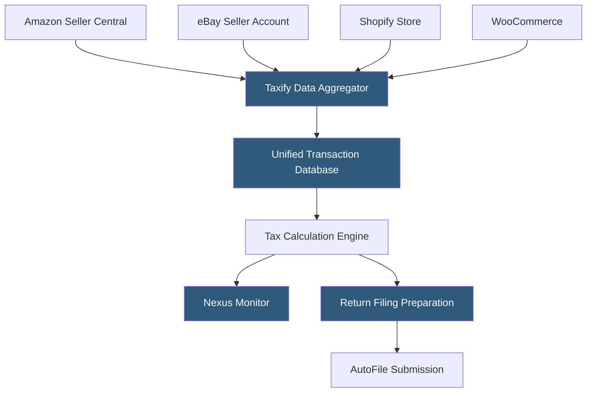

**Category:** Sales Tax & Indirect Tax
**Difficulty:** Beginner
**Reading time:** 5 min read

---

Taxify (now Sovos Taxify after acquisition) is a sales tax automation platform targeting small to mid-size e-commerce businesses, providing real-time tax calculation APIs, multi-channel integrations with Amazon, eBay, Etsy, and major shopping carts, and return filing services. It emphasizes ease of setup for merchants who sell across multiple marketplaces.

- **Multi-Channel Integration** — simultaneous connections to Amazon Seller Central, eBay, Etsy, Shopify, WooCommerce, and others for unified tax data
- **Marketplace Facilitator Tracking** — identifying which marketplace transactions are tax-collected by the platform vs. requiring merchant collection
- **Rooftop Calculation** — address-level tax determination accounting for local district taxes
- **AutoFile** — automated return preparation and filing in registered states
- **Nexus Monitor** — tracking economic nexus thresholds across states based on aggregated multi-channel sales
- **Exemption Management** — storing and applying tax exemption certificates for B2B customers
- **Sales Tax Report** — period-based reports showing tax collected by jurisdiction for return reconciliation

Taxify connects to multiple selling channels through official API integrations and marketplace data exports. Merchants authenticate each channel during setup, and Taxify pulls transaction history and ongoing sales data. This multi-channel aggregation is particularly valuable for marketplace sellers who sell on Amazon, their own Shopify store, and eBay simultaneously—Taxify consolidates all sales into a unified view for nexus monitoring and return filing.

Marketplace facilitator tracking identifies which transactions had tax collected by the marketplace (Amazon in most states after economic nexus legislation) versus which required merchant-direct collection. This prevents double-counting of tax obligations and accurate reporting on returns where marketplace-facilitated sales appear separately.

The nexus monitor tracks rolling 12-month sales by state across all channels, alerting merchants when approaching $100,000 or 200 transaction thresholds in new states. When a threshold is crossed, Taxify guides the registration process.

AutoFile manages return filing using the aggregated transaction data. Returns generate for each registered state, and Taxify files them electronically while initiating payment via ACH.

- Multi-marketplace sellers combining Amazon, eBay, Etsy, and direct channels
- Small e-commerce businesses needing affordable compliance without enterprise pricing
- Merchants with growing multi-state exposure needing nexus monitoring
- Sellers recently acquired nexus in multiple states after marketplace facilitator changes
- Small businesses wanting a full-service solution from calculation through filing

| Advantage | Disadvantage |
|-----------|--------------|
| Multi-marketplace aggregation is a key differentiator | Less suitable for enterprise ERP integration scenarios |
| Affordable pricing for small to mid-size merchants | Now under Sovos ownership with uncertain roadmap for small merchants |
| Marketplace facilitator handling reduces compliance complexity | Feature depth less than Avalara or Vertex |
| Easy setup for common marketplace and cart combinations | Limited to US sales tax; minimal international support |

- [TaxJar Sales Tax Engine](taxjar-sales-tax-engine.md)
- [Marketplace Facilitator Rules](marketplace-facilitator-rules.md)
- [Avalara AvaTax Platform](avalara-avatax-platform.md)

---
*Part of the [Sales Tax & Indirect Tax](index.md) category · [Back to Master Index](../../index.md)*
