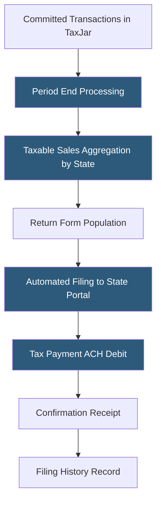

**Category:** Sales Tax & Indirect Tax
**Difficulty:** Beginner
**Reading time:** 5 min read

---

TaxJar AutoFile is the managed return filing service within TaxJar that automatically prepares, files, and remits sales tax returns in all states where a business is registered. It operates from transaction data committed to TaxJar, eliminating the manual work of monthly and quarterly sales tax filing across multiple states without requiring any action from the business owner each filing period.

- **Auto-Enrollment** — the process of connecting a state tax registration to TaxJar AutoFile and providing bank authorization for payment
- **Filing Frequency** — the state-assigned cadence for returns (monthly, quarterly, annually) based on the business's annual tax liability in each state
- **Debit Authorization** — the ACH payment permission granted to TaxJar enabling automated payment remittance on behalf of the business
- **State Portal Credentials** — the login information for each state's online tax filing portal, stored securely by TaxJar for automated submission
- **Zero Return** — a return filed for a period where the business had no taxable sales in the state, required to maintain active registration
- **Prior Period Adjustment** — a correction applied to a previously filed return when transaction errors are discovered
- **Filing Confirmation** — the acceptance acknowledgment from the state tax authority confirming receipt of the return

AutoFile enrollment requires two components: state registration credentials and bank authorization. Business owners provide their login credentials for each state's tax portal (e.g., MyTax Illinois, Ohio Gateway) which TaxJar stores encrypted in its vault. They also authorize TaxJar to debit their checking account for tax payments via ACH.

At each filing period end, TaxJar aggregates all committed transactions for the period, computing taxable sales and tax collected by state and jurisdiction. For each enrolled state, TaxJar's return preparation engine maps these figures to the state's specific return form fields—states vary significantly in their return formats, some requiring county-level breakdowns while others require only state totals.

TaxJar logs into each state's e-filing portal using the stored credentials, populates and submits the return, and triggers the ACH debit for the tax due. Returns filing on paper (a minority of states) are handled through mail. Filing confirmation screenshots and confirmation numbers store in the TaxJar account for audit access.

Zero returns—required when a business had no sales in a registered state during a period—file automatically, preventing the administrative oversight of missing zero-activity filings that can trigger delinquent notices.

- E-commerce merchants registered in 10+ states seeking zero-touch filing
- Growing businesses that recently crossed nexus thresholds in multiple new states
- Finance teams wanting to eliminate multi-state filing calendar management
- Seasonal businesses ensuring returns file even during low-activity periods
- Businesses that previously filed manually wanting to reclaim staff time

| Advantage | Disadvantage |
|-----------|--------------|
| Truly zero-touch filing after enrollment setup | Business owner responsible for reviewing returns before filing period (no explicit approval step by default) |
| Handles zero returns preventing delinquent notices | Requires accurate and complete transaction commits to produce correct returns |
| Stores state portal credentials securely for automated access | Some state portals change login requirements or MFA settings disrupting automation |
| Filing history archive supports audit documentation | Per-state monthly fee adds to compliance costs at scale |

- [TaxJar Sales Tax Engine](taxjar-sales-tax-engine.md)
- [Sales Tax Filing Automation](sales-tax-filing-automation.md)
- [Avalara Managed Returns](avalara-managed-returns.md)

---
*Part of the [Sales Tax & Indirect Tax](index.md) category · [Back to Master Index](../../index.md)*
