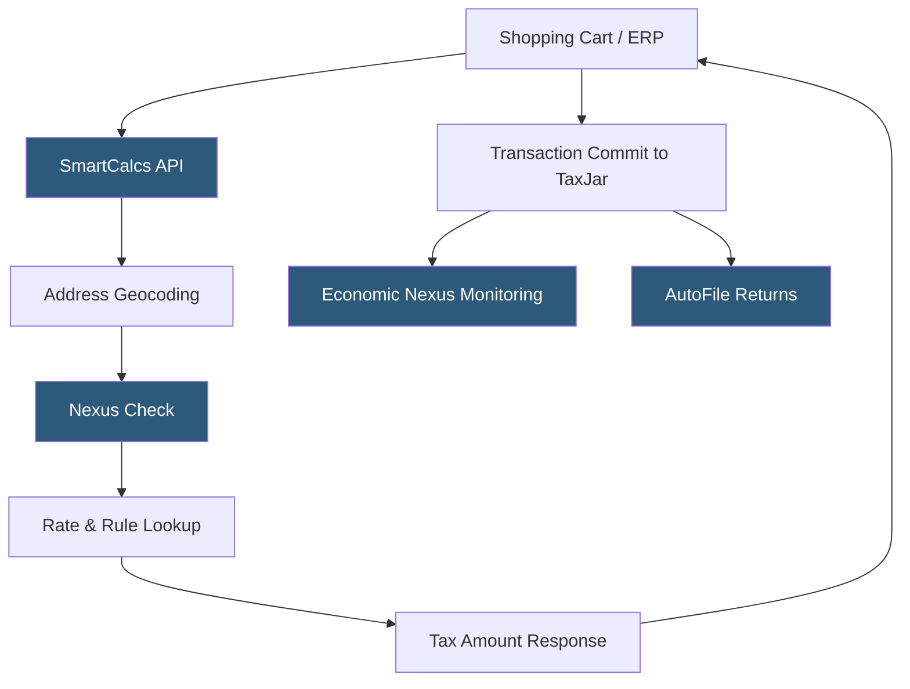

**Category:** Sales Tax & Indirect Tax
**Difficulty:** Intermediate
**Reading time:** 6 min read

---

TaxJar is a cloud-based sales tax automation platform (now a Stripe company) providing real-time sales tax calculation, economic nexus monitoring, and automated return filing for e-commerce businesses and SaaS companies. It is known for its developer-friendly REST API, accurate rooftop-level tax calculation, and transparent pricing that makes it accessible to growing businesses.

- **SmartCalcs API** — TaxJar's core REST API providing real-time sales tax calculation for transactions and order lines
- **Rooftop Accuracy** — address-level tax calculation accounting for special taxing districts that change at the street level (e.g., MTA surcharges)
- **Economic Nexus Dashboard** — TaxJar's monitoring feature tracking sales by state against economic nexus thresholds (typically $100,000 or 200 transactions)
- **AutoFile** — TaxJar's managed return filing service that automatically files and remits returns in registered states
- **Product Exemption Categories** — TaxJar's 27 categorizations mapping product types to state-specific taxability rules
- **Transaction Import** — bulk import of historical orders via CSV or shopping cart integration for back-calculations
- **Sales Tax Report** — jurisdiction-level aggregated tax liability reports supporting return preparation

TaxJar's SmartCalcs API accepts transaction data and returns accurate tax calculations within 100–200 milliseconds. A typical request includes the origin address (warehouse or seller location), destination address (ship-to), line item amounts, product type codes, and any customer exemption codes. TaxJar resolves both addresses to precise tax jurisdictions using its geocoding engine and applies the appropriate state, county, city, and district rates.

TaxJar's nexus management distinguishes it from simple rate calculators. The platform tracks every committed transaction by destination state and monitors accumulated sales against economic nexus thresholds. When a business approaches the threshold in a new state ($100,000 in sales or 200 transactions in most states), TaxJar sends alerts and guides the registration process. This proactive monitoring prevents unintentional nexus violations.

AutoFile operates from committed transaction data. TaxJar aggregates all transactions for the filing period by state, applies the correct taxable sales calculations for that state's return form, and files on behalf of the business. Unlike some competitors, TaxJar also handles the state registration process for businesses needing to register in new states.

The Stripe integration (following Stripe's 2021 acquisition) enables Stripe-billed businesses to enable TaxJar tax calculation directly within Stripe's billing and payment flows, using Stripe Tax as the underlying product powered by TaxJar data.

- E-commerce merchants needing accurate multi-state tax calculation
- SaaS businesses navigating digital goods taxability rules by state
- Businesses monitoring economic nexus thresholds as they grow
- Small to mid-size businesses wanting affordable managed filing
- Stripe customers seeking embedded tax calculation in billing flows

| Advantage | Disadvantage |
|-----------|--------------|
| Developer-friendly API with clear documentation | Enterprise features less robust than Avalara or Vertex |
| Economic nexus monitoring proactively prevents compliance gaps | Rooftop-level accuracy requires reliable address data from caller |
| Transparent per-API-call pricing scales with business size | International tax coverage less comprehensive than US coverage |
| AutoFile handles return preparation and submission | Stripe acquisition has shifted product roadmap emphasis |

- [Avalara AvaTax Platform](avalara-avatax-platform.md)
- [TaxJar AutoFile Returns](taxjar-autofile-returns.md)
- [Economic Nexus Monitoring](economic-nexus-monitoring.md)

---
*Part of the [Sales Tax & Indirect Tax](index.md) category · [Back to Master Index](../../index.md)*
