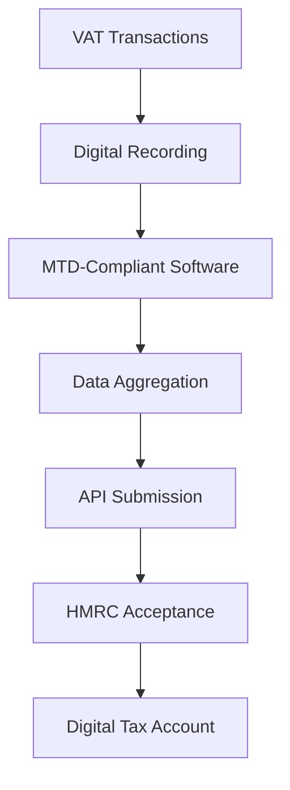

**Category:** Sales Tax & Indirect Tax
**Difficulty:** Intermediate
**Reading time:** 6 min read

---

Making Tax Digital (MTD) for VAT is the UK's digital tax system requiring businesses to use software for VAT record-keeping and filing. It mandates frequent submission of VAT data using standardized digital formats and APIs.

- **Digital Records** — VAT data kept in digital format meeting standards
- **MTD Software** — applications meeting HMRC specifications
- **Quarterly Filings** — regular VAT returns submitted digitally
- **API Integration** — standardized connections for data submission
- **Digital Tax Account** — HMRC online portal for filing and communication

MTD requires businesses to maintain VAT records in digital format using government-approved software. The system tracks all VAT transactions in real-time, categorizing supplies, acquisitions, and special scenarios. At the end of each quarter, the business prepares its VAT return using the MTD software, which calculates net VAT owed. The software submits the return via API directly to HMRC's systems, eliminating manual form submission. HMRC provides real-time confirmation and allows businesses to view submission history in their digital tax account. Penalties apply for non-compliance, including late filing penalties and interest on late payments.

- Quarterly VAT return filing with HMRC
- Managing digital VAT records for businesses
- Integrating accounting software with MTD
- Maintaining audit-ready digital documentation
- Meeting HMRC compliance requirements

| Advantage | Disadvantage |
|-----------|--------------|
| Automated data submission | Software purchase or subscription |
| Real-time HMRC communication | Compatibility issues with existing systems |
| Reduced filing errors | Quarterly filing frequency |
| Digital audit trail | Penalties for non-compliance |
| Faster processing | Learning curve for users |

- [EU VAT compliance](eu-vat-compliance.md)
- [VAT (Value Added Tax) compliance](vat-value-added-tax-compliance.md)
- [Digital services tax (DST)](digital-services-tax-dst.md)

---
*Part of the [Sales Tax & Indirect Tax](sales-tax-indirect-tax/index.md) category · [Back to Master Index](../../index.md)*
