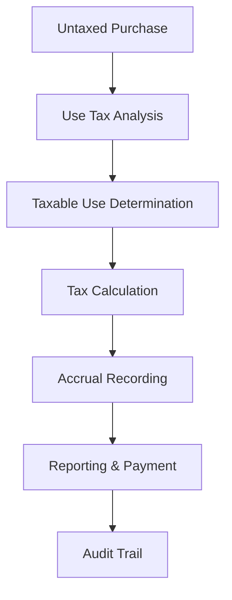

**Category:** Sales Tax & Indirect Tax
**Difficulty:** Intermediate
**Reading time:** 6 min read

---

Use tax compliance manages the obligation to pay tax on purchases made for business use when sales tax was not collected at purchase. These systems track non-taxed acquisitions and ensure proper tax reporting and payment.

- **Use Tax** — tax on goods purchased without sales tax but used in taxable activities
- **Taxable Use** — consuming goods or services in the course of business operations
- **Resale Certificate** — documentation exempting purchases from sales tax when items are resold
- **Reverse Charge** — mechanism where purchaser pays tax instead of seller
- **Accrual** — recording use tax liability in accounting records

Use tax compliance systems identify purchases made without sales tax that should have been taxed. When a business buys goods or services for use in operations without collecting sales tax, the system calculates the equivalent tax obligation. It tracks out-of-state purchases, exempt purchases used in taxable activities, and goods acquired for business purposes. The system generates accruals in the accounting system to reflect use tax liabilities. Compliance reporting includes use tax returns filed with tax authorities, often combined with sales tax filings. The system maintains audit documentation showing the basis for use tax calculations and exemption claims.

- Tracking out-of-state purchases subject to use tax
- Recording equipment and supply acquisitions
- Managing resale exemption certificates
- Reverse charge reporting for international purchases
- Audit trail documentation for use tax obligations

| Advantage | Disadvantage |
|-----------|--------------|
| Comprehensive tax compliance | Complex to track all purchases |
| Audit-ready documentation | Requires classification discipline |
| Reduces tax penalties | Integration with AP systems needed |
| Accurate accruals | Manual review often necessary |
| Multi-state support | Compliance varies by jurisdiction |

- [Sales tax rate databases](sales-tax-rate-databases.md)
- [Sales tax filing automation](sales-tax-filing-automation.md)
- [Reverse sales tax calculation](reverse-sales-tax-calculation.md)

---
*Part of the [Sales Tax & Indirect Tax](sales-tax-indirect-tax/index.md) category · [Back to Master Index](../../index.md)*
