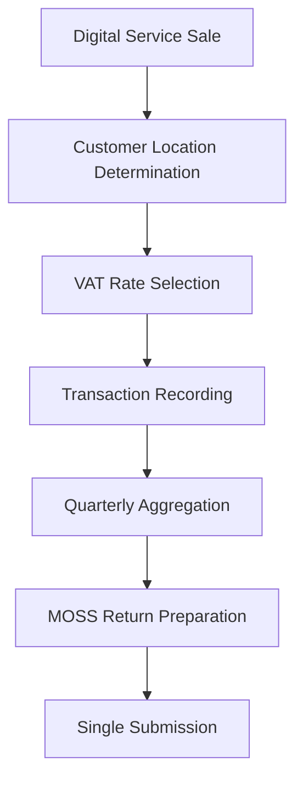

**Category:** Sales Tax & Indirect Tax
**Difficulty:** Intermediate
**Reading time:** 6 min read

---

VAT MOSS (Mini One Stop Shop) is a simplified VAT compliance scheme for businesses selling digital services to EU consumers. It allows a single VAT return to cover multiple EU jurisdictions instead of registering separately in each member state.

- **Digital Services** — online services like software, e-books, and streaming
- **Single Registration** — one VAT submission covering multiple countries
- **Place of Supply Rules** — determining which jurisdiction's VAT applies
- **Distance Selling** — cross-border supply of goods or services
- **Quarterly Return** — periodic MOSS submission summarizing transactions

MOSS allows eligible businesses to register in one EU member state and file a single quarterly VAT return covering supplies to consumers across the EU. The system determines the customer's location using IP address, payment details, or customer information. Based on location, the appropriate VAT rate is applied to the transaction. Transactions are recorded and aggregated by customer jurisdiction. The quarterly MOSS return summarizes supplies to each member state, showing VAT collected and paid. The registration member state receives the return and distributes the VAT proceeds to the actual destination states. This simplifies compliance compared to registering separately in multiple countries.

- Selling e-books across EU member states
- Providing digital training or courses to consumers
- Hosting SaaS services for EU customers
- Delivering digital content to multiple countries
- Simplifying cross-border digital commerce

| Advantage | Disadvantage |
|-----------|--------------|
| Single registration simplifies admin | Only for digital services |
| One return covers multiple states | Strict place of supply rules |
| Reduced compliance costs | Consumer location determination required |
| Simplified reporting | Complex refund procedures |
| Faster settlement | Covers distance selling only partially |

- [VAT OSS (One Stop Shop)](vat-oss-one-stop-shop.md)
- [EU VAT compliance](eu-vat-compliance.md)
- [VAT (Value Added Tax) compliance](vat-value-added-tax-compliance.md)

---
*Part of the [Sales Tax & Indirect Tax](sales-tax-indirect-tax/index.md) category · [Back to Master Index](../../index.md)*
