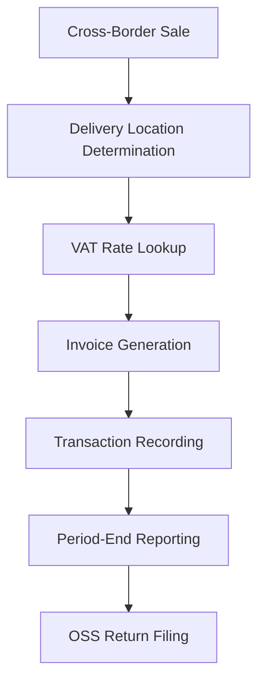

**Category:** Sales Tax & Indirect Tax
**Difficulty:** Intermediate
**Reading time:** 6 min read

---

VAT OSS (One Stop Shop) is an EU scheme allowing businesses selling goods and services across member states to use a single return instead of registering for VAT in each jurisdiction. It simplifies compliance for non-EU sellers entering the EU market.

- **Distance Sales** — selling goods or services across border without physical presence
- **OSS Registration** — simplified registration in one member state
- **Supply Reporting** — tracking sales by customer jurisdiction
- **VAT Rate Application** — applying correct rate based on delivery location
- **Monthly/Quarterly Filing** — regular OSS return submission

OSS enables businesses, particularly non-EU sellers, to register for VAT in one EU member state and file a single return covering supplies across the EU. The system determines where goods are delivered or services consumed to apply the correct VAT rate. Transactions are recorded and categorized by destination jurisdiction. Regular returns (monthly or quarterly depending on volumes) are filed showing sales to each member state and the VAT applicable. The OSS registration member state handles collections and distributes VAT to destination states. This eliminates the need for separate registrations and filings in each country, significantly reducing administrative burden for cross-border sellers.

- Non-EU e-commerce sellers entering EU market
- Cross-border goods sales within EU
- EU businesses expanding sales internationally
- Mixed goods and services across borders
- Simplifying VAT for EU-wide operations

| Advantage | Disadvantage |
|-----------|--------------|
| Single registration reduces admin | Goods sales more complex than MOSS |
| One return covers multiple states | Delivery location must be determined |
| Reduced compliance costs | Complex rate application rules |
| Wider applicability than MOSS | Refund procedures are involved |
| Faster setup | Ongoing monitoring requirements |

- [VAT MOSS (Mini One Stop Shop)](vat-moss-mini-one-stop-shop.md)
- [EU VAT compliance](eu-vat-compliance.md)
- [Cross-border tax compliance](cross-border-tax-compliance.md)

---
*Part of the [Sales Tax & Indirect Tax](sales-tax-indirect-tax/index.md) category · [Back to Master Index](../../index.md)*
