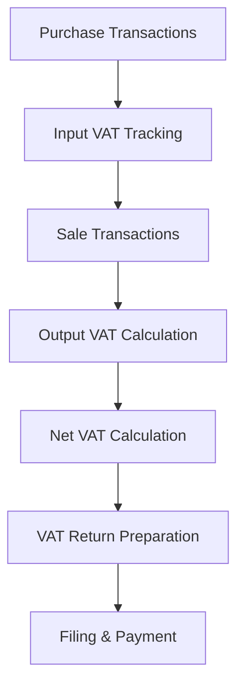

**Category:** Sales Tax & Indirect Tax
**Difficulty:** Intermediate
**Reading time:** 6 min read

---

VAT compliance involves managing Value Added Tax obligations across multiple jurisdictions where applicable. VAT is a multi-stage tax collected at each point in the supply chain, with businesses able to recover input VAT on purchases.

- **Value Added Tax (VAT)** — consumption tax collected at each supply chain stage
- **Input VAT** — tax paid on business purchases that can be recovered
- **Output VAT** — tax charged to customers on sales
- **VAT Recovery** — claiming refunds for input tax paid
- **VAT Return** — periodic filing of VAT obligations and recovery claims

VAT systems track two streams of tax: input VAT on business purchases (recoverable) and output VAT on customer sales (payable). The business calculates net VAT by subtracting total input VAT from total output VAT, paying only the difference. Each transaction is classified as taxable, zero-rated, or exempt based on nature and jurisdiction rules. The system maintains detailed records showing VAT amounts, rates applied, and supporting documentation. Periodic returns are filed with tax authorities reconciling all VAT transactions. For international transactions, reverse charge mechanisms and special rules apply. Systems must handle multiple VAT rates for different product categories.

- Managing VAT across EU member states
- Claiming input VAT recovery on business purchases
- Filing periodic VAT returns with authorities
- Handling zero-rated and exempt transactions
- Cross-border supply VAT compliance

| Advantage | Disadvantage |
|-----------|--------------|
| Input VAT recovery improves cash flow | Complex classification rules |
| Burden shifts to business operators | Extensive documentation required |
| Neutral on final consumer | Multiple rate scenarios |
| Clear audit trails | Cross-border complexity |
| Reduces tax evasion | Technology integration challenges |

- [EU VAT compliance](eu-vat-compliance.md)
- [VAT MOSS (Mini One Stop Shop)](vat-moss-mini-one-stop-shop.md)
- [VAT OSS (One Stop Shop)](vat-oss-one-stop-shop.md)

---
*Part of the [Sales Tax & Indirect Tax](sales-tax-indirect-tax/index.md) category · [Back to Master Index](../../index.md)*
