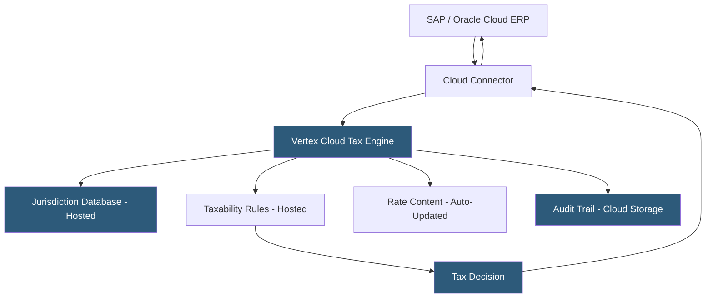

**Category:** Sales Tax & Indirect Tax
**Difficulty:** Intermediate
**Reading time:** 6 min read

---

Vertex Cloud is the SaaS delivery model of Vertex's indirect tax calculation platform, providing the same enterprise-grade tax engine as Vertex O Series through a cloud-hosted, subscription-based model. It targets mid-market organizations that want Vertex's deep tax content and ERP integration without managing on-premises server infrastructure.

- **Cloud Tax Engine** — Vertex's tax calculation logic delivered as a hosted API service without local installation
- **Cloud Connector** — pre-built integration modules connecting cloud ERPs (SAP S/4HANA Cloud, Oracle Fusion) to Vertex Cloud
- **Content Updates** — automatic tax rate and rule updates applied by Vertex to the cloud engine without customer maintenance windows
- **Multi-Tenant SaaS** — Vertex Cloud's deployment model with customer data isolation and shared underlying infrastructure
- **REST API** — the modern API interface available for custom integrations to Vertex Cloud tax calculation
- **Vertex Compliance Cloud** — the broader Vertex SaaS platform encompassing calculation, returns, and e-invoicing
- **Hybrid Deployment** — a configuration combining Vertex Cloud for some systems and on-premises O Series for others

Vertex Cloud eliminates the infrastructure management burden of on-premises O Series while retaining Vertex's tax content depth. Organizations connect their ERPs to Vertex Cloud through pre-built connectors certified for SAP Business Technology Platform, SAP S/4HANA Cloud, Oracle Fusion Cloud, and Salesforce CPQ. These connectors handle authentication, data mapping, and API communication between the ERP and the hosted Vertex engine.

Tax calculation requests travel over HTTPS to Vertex Cloud's API endpoints, which are geo-distributed for low latency and high availability (Vertex publishes 99.9% uptime SLAs). The engine processes requests using the same core algorithm as O Series: jurisdiction determination, taxability evaluation, and rate application. Tax content updates deploy automatically—Vertex's tax research team monitors state and local legislative changes and updates the hosted database without customer involvement.

Rule configuration (Tax Assist) works identically to O Series, allowing tax analysts to configure product-specific taxability overrides through the management console. Rules persist in Vertex's cloud storage and apply to all requests from that customer environment.

The transition from O Series on-premises to Vertex Cloud is Vertex's standard modernization path, and migration tools facilitate moving existing rule configurations and historical audit data.

- Mid-market companies wanting enterprise tax engine depth without server management
- SAP or Oracle Cloud ERP customers needing certified Vertex integration
- Organizations transitioning from O Series on-premises to reduce infrastructure costs
- Companies with seasonal volume spikes benefiting from cloud scalability
- Global businesses needing EU VAT and US sales tax in a single platform

| Advantage | Disadvantage |
|-----------|--------------|
| Automatic content updates eliminate manual maintenance | Internet dependency adds latency vs. on-premises engine |
| Scales elastically during high-volume periods | Higher long-term cost vs. perpetual on-premises license |
| Same tax content depth as O Series without infrastructure | Data residency constraints may prevent cloud use in some regions |
| Faster implementation than on-premises deployment | Premium pricing vs. cloud-native competitors like Avalara |

- [Vertex Sales Tax O Series](vertex-sales-tax-o-series.md)
- [Avalara AvaTax Platform](avalara-avatax-platform.md)
- [Sovos S1 Sales & Use Tax](sovos-s1-sales-use-tax.md)

---
*Part of the [Sales Tax & Indirect Tax](index.md) category · [Back to Master Index](../../index.md)*
