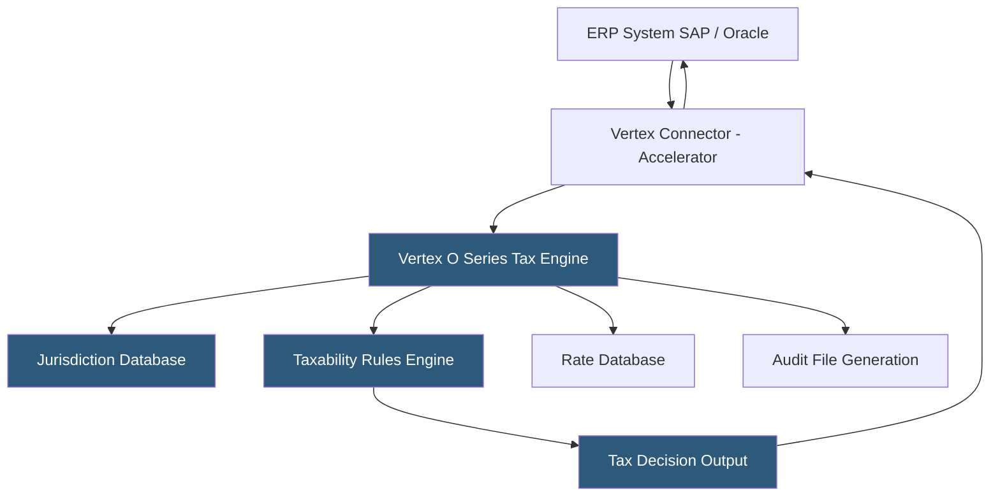

**Category:** Sales Tax & Indirect Tax
**Difficulty:** Advanced
**Reading time:** 7 min read

---

Vertex O Series is an enterprise-grade indirect tax engine deployed on-premises or in the cloud, designed for large organizations with complex tax requirements that need deep integration with SAP, Oracle, and other ERP systems. It provides highly configurable tax calculation logic, extensive taxability rules, and a centralized tax decision platform built for high-volume transactional environments.

- **Tax Decision** — the complete tax calculation output for a transaction, including applicable jurisdictions, rates, and amounts
- **Tax Assist** — Vertex's rule configuration interface for defining custom tax treatment for specific product/customer/jurisdiction combinations
- **Taxability Rules** — jurisdiction-specific determinations of which products and services are taxable, exempt, or subject to reduced rates
- **Vertex Accelerator** — pre-built ERP connectors for SAP S/4HANA, SAP ECC, Oracle EBS, and Oracle Cloud providing certified integration
- **Tax Override** — a manually configured exception to standard calculated tax for specific scenarios
- **Return Filing** — integrated return preparation and filing using calculation data from Vertex, available through Vertex Returns
- **Indirect Tax Suite** — Vertex's broader platform including O Series for calculation, Returns for filing, and Payroll Tax for employer tax

Vertex O Series operates as a tax co-processor alongside ERP systems. When SAP or Oracle generates a taxable document—sales order, purchase order, invoice—the ERP passes transaction data to Vertex via the pre-built Accelerator connector. The connector translates ERP data structures into Vertex's tax request format, handling the mapping of ERP material codes to Vertex product codes, location data to jurisdictions, and customer master data to exemption categories.

The Vertex tax engine processes each request through a three-step decision: jurisdiction determination (which authorities tax this transaction?), taxability determination (is this product taxable in each jurisdiction?), and rate application (what rate applies after exemptions?). Each step draws from Vertex's maintained databases—jurisdiction content including 12,000+ US tax authorities and data for 192 countries—plus the company's configured overrides and custom rules.

Tax Assist provides a rule configuration interface where tax analysts define exceptions to standard tax logic without coding: "When product category X is sold to a customer in state Y with exemption reason Z, apply rate override of 0%." These rules give large organizations the flexibility to encode their specific product taxability determinations while relying on Vertex for base jurisdiction and rate data.

The resulting tax decisions write back to the ERP as tax line items on documents. All decisions log in an audit file—a structured record of every transaction, applicable rules, and calculated amounts—that provides evidence for audit defense.

- Large enterprises requiring on-premises tax engine deployment for data residency
- SAP or Oracle ERP shops needing certified deep integration
- Organizations with complex product taxability requiring extensive rule configuration
- Global businesses calculating US, EU, and APAC indirect taxes in a single engine
- High-transaction-volume businesses (millions of invoices monthly) needing performance

| Advantage | Disadvantage |
|-----------|--------------|
| Certified SAP and Oracle integration depth unmatched | Higher cost and implementation complexity than cloud-first platforms |
| On-premises deployment option satisfies data sovereignty requirements | Requires Vertex-specialist consultants for implementation |
| Highly configurable rules for complex product taxability | Longer implementation timelines than SaaS alternatives |
| Handles global indirect tax in a single platform | Annual maintenance cost for content updates and support |

- [Vertex Cloud Indirect Tax](vertex-cloud-indirect-tax.md)
- [Avalara AvaTax Platform](avalara-avatax-platform.md)
- [Sovos S1 Sales & Use Tax](sovos-s1-sales-use-tax.md)

---
*Part of the [Sales Tax & Indirect Tax](index.md) category · [Back to Master Index](../../index.md)*
