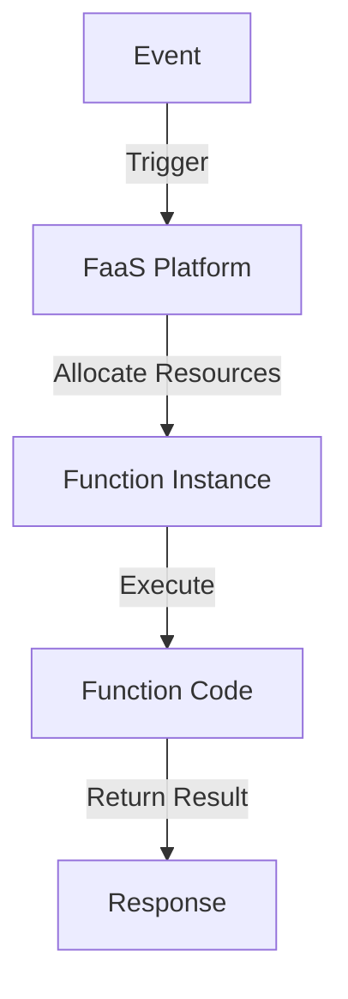

**Category:** Serverless Computing
**Difficulty:** Intermediate
**Reading time:** 6 min read

---

FaaS is a cloud computing model where developers write stateless functions executed in response to events. Providers handle infrastructure scaling and management automatically.

- **Stateless Functions** — pure functions with no persistent state
- **Event Triggers** — functions executed on events
- **Auto-Scaling** — automatic resource allocation
- **Pay-Per-Execution** — billing based on usage
- **Cold Starts** — latency from function initialization

Developers write small functions responding to events. The platform stores and manages functions. When events occur, the platform allocates compute resources and executes functions. Results are returned to event sources. Functions complete quickly or timeout. The platform automatically scales to handle event volume. Billing is based on execution time and invocations. Cold starts occur when initializing new function instances.

- API backends
- Data processing pipelines
- IoT event handling
- Scheduled tasks
- Webhooks and integrations
- Real-time file processing
- Mobile app backends

| Advantage | Disadvantage |
|-----------|--------------|
| No infrastructure management | Cold start latencies |
| Automatic scaling | Stateless limitation |
| Pay only for execution | Debugging is complex |
| Simple deployment model | Vendor lock-in |
| Quick time to production | Long-running tasks unsuitable |

- [Serverless architectures](serverless-architectures.md)
- [Function optimization techniques](function-optimization.md)
- [Event-driven patterns](event-driven.md)

---
*Part of the [Serverless Computing](serverless-computing/index.md) category · [Back to Master Index](../../index.md)*
