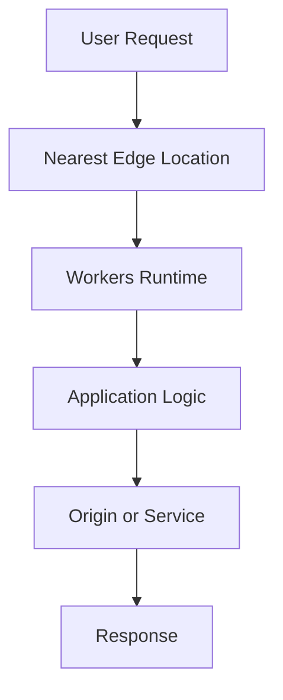

**Category:** Serverless & Edge Platforms
**Difficulty:** Intermediate
**Reading time:** 6 min read

---

Cloudflare Workers is a serverless computing platform that executes JavaScript code at the edge of Cloudflare's global network, closer to users than traditional centralized data centers. The platform enables building and deploying applications instantly across 275+ global data centers with sub-millisecond latency, supporting both synchronous request/response applications and background workers processing asynchronous tasks.

- **V8 Isolates** — lightweight execution contexts using JavaScript V8 engine for fast startup
- **Global Deployment** — code instantly deployed to all Cloudflare edge locations worldwide
- **Request/Response Pattern** — synchronous HTTP request handling at the edge
- **Durable Objects** — strongly consistent storage and coordination primitives
- **Sub-Millisecond Latency** — geographic proximity to users minimizing network latency

Cloudflare Workers execute code at edge locations nearest to users, eliminating the latency of routing requests to distant origin servers. Code is written in JavaScript and deployed instantly to the entire global network without provisioning servers. Workers can intercept and modify requests, cache responses, perform authentication, handle dynamic content generation, and route traffic. The platform uses V8 isolates instead of containers, providing near-zero startup time and minimal resource overhead. Integration with Durable Objects enables stateful applications requiring consistency, while APIs provide access to Cloudflare's edge network capabilities.

- API proxying and request transformation
- Content authentication and manipulation
- Real-time personalization and A/B testing
- DDoS and bot mitigation
- Geolocation-based routing and content delivery
- Authentication and authorization enforcement
- Dynamic content generation
- Serverless microservice backends

| Advantage | Disadvantage |
|-----------|--------------|
| Global deployment with single command | Limited to JavaScript runtime |
| Sub-millisecond cold start time | CPU time billing limits per request |
| No server provisioning required | Must write stateless code primarily |
| Cost-effective for low-traffic applications | Debugging more complex than local |
| Bandwidth included in pricing | Monitoring less mature than alternatives |

- [V8 Isolates vs Containers](v8-isolates-vs-containers.md)
- [Cold Start Optimization](cold-start-optimization.md)
- [Workers KV Edge Storage](workers-kv-edge-storage.md)

---
*Part of the [Serverless & Edge Platforms](index.md) category · [Back to Master Index](../../index.md)*

---
*Part of the [Serverless & Edge Platforms](index.md) category · [Back to Master Index](../../index.md)*
