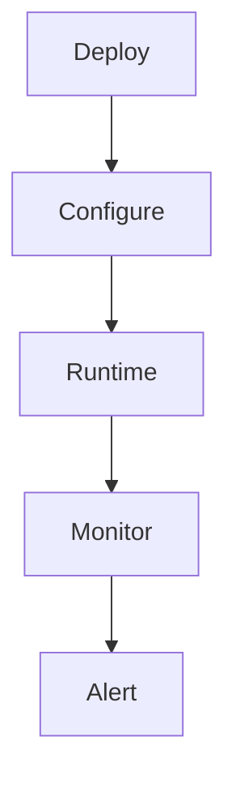

**Category:** Specialized AI Inference Platforms
**Difficulty:** Intermediate
**Reading time:** 6 min read

---

Lightning.ai Studios is a fundamental concept within Specialized AI Inference Platforms that enables teams to build scalable, reliable systems. Mastering it allows engineers to make informed architectural decisions and operate infrastructure more effectively.

- **Core abstraction** — the primary interface that lightning.ai studios exposes to consumers and operators
- **Configuration layer** — settings and parameters that control lightning.ai studios runtime behavior
- **Scalability model** — how lightning.ai studios grows to meet increasing demand without redesign
- **Reliability mechanisms** — the built-in fault-tolerance and recovery capabilities
- **Observability surface** — metrics, logs, and traces emitted for operational visibility

Lightning.ai Studios functions as part of the Specialized AI Inference Platforms stack by abstracting lower-level complexity behind a defined interface. Incoming requests or workloads are received by an ingestion layer that handles authentication, validation, and routing before passing control to the core processing engine.

The engine applies the primary logic — whether computation, data transformation, coordination, or storage — and produces a result. State is maintained using a combination of ephemeral in-memory caches for fast reads and durable backing stores for persistence. Configuration is externalized to allow behavior changes without redeployment.

Health signals are continuously emitted to monitoring systems, enabling automated alerts when thresholds are exceeded. Integration with adjacent services occurs through versioned APIs or message queues, maintaining loose coupling. Infrastructure is provisioned via declarative tooling to ensure reproducibility across environments. Autoscaling policies adjust capacity in response to real-time load metrics, minimizing both over-provisioning costs and under-provisioning latency spikes.

- Running lightning.ai studios in production environments that require high availability and fault tolerance
- Integrating lightning.ai studios with CI/CD pipelines for automated deployment and rollback
- Scaling lightning.ai studios horizontally to handle traffic spikes and bursty workloads
- Securing lightning.ai studios with authentication, encryption, and access control policies
- Monitoring lightning.ai studios with metrics dashboards and automated alerting

| Advantage | Disadvantage |
|-----------|--------------|
| Reduces manual operations through automation and abstraction | Abstraction can hide low-level failure modes from operators |
| Enables consistent deployments across development and production | Initial configuration and integration requires upfront effort |
| Scales horizontally to meet growing demand | Distributed deployment introduces consistency and latency trade-offs |
| Integrates with standard ecosystem tooling | May introduce vendor or platform dependency over time |

- [Back to Specialized AI Inference Platforms Index](index.md)
- [Master Index](../../index.md)

---
*Part of the [Specialized AI Inference Platforms](index.md) category · [Back to Master Index](../../index.md)*
