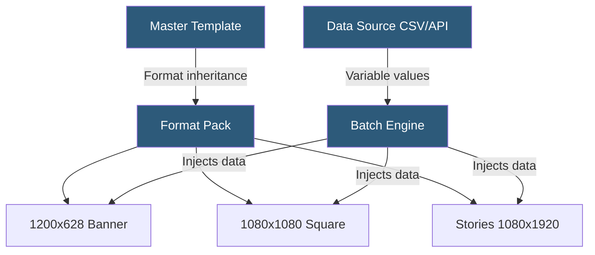

**Category:** Specialized Automation Platforms
**Difficulty:** Intermediate
**Reading time:** 6 min read

---

Abyssale is a creative automation platform specializing in generating hundreds of ad banner variations from a single master template. It is designed for performance marketers and growth teams who need to A/B test visual creatives across multiple formats and channels simultaneously.

- **Master Template** — A single design that spawns multiple output formats through format inheritance
- **Format** — A size/layout variant (e.g., 1200×628, 1080×1080) generated from the master template
- **Variable Layer** — A design element populated with dynamic data from a connected spreadsheet or API
- **Batch Generation** — Producing many image variants in a single job from a data matrix
- **Format Pack** — A preset collection of standard ad sizes for Facebook, Google, LinkedIn, and others
- **CSV Import** — Feeding rows of data to produce one image per row across all formats
- **API Automation** — Programmatic generation via REST for continuous content pipelines

Abyssale's core innovation is format-aware template inheritance. A designer creates one master template at a canonical size, then defines additional format variants by specifying how layers should reposition or resize. Text wrapping, image cropping, and element visibility can differ per format — but all formats share the same data bindings.

When generating a batch, you supply a data matrix: either a CSV upload or a JSON array via API. Each row becomes one creative set, producing images in every registered format simultaneously. The engine renders all combinations and packages them for download or streams webhook events as each completes.

For ongoing pipelines, the REST API accepts POST requests with a template ID and a `data` array. The response includes a job ID, and a webhook fires when the batch finishes. Abyssale integrates natively with Google Sheets, allowing marketers to maintain a creative brief in a spreadsheet and regenerate all assets on demand.

The platform stores all generated images on its CDN with permanent URLs, and each image URL carries consistent naming so downstream ad platforms can be updated programmatically.

- Performance marketing creative testing at scale
- E-commerce seasonal banner refreshes across all ad formats
- Localization — generating language variants from translated copy columns
- Dynamic retargeting ad creative generation
- Agency batch deliverables across multiple client campaigns

| Advantage | Disadvantage |
|-----------|--------------|
| Format-pack inheritance reduces duplication | Template editor has a steeper learning curve |
| CSV-to-batch workflow accessible for non-developers | Pricing can be significant at high batch volumes |
| Native Google Sheets sync | Less flexibility for complex layered designs |
| Single source of truth for multi-format campaigns | Limited animation/video output support |

- [Bannerbear Automated Image Generation](bannerbear-automated-image-generation.md)
- [Placid Automated Design Generation](placid-automated-design-generation.md)
- [Parabola No-Code ETL](parabola-no-code-etl.md)

---
*Part of the [Specialized Automation Platforms](index.md) category · [Back to Master Index](../../index.md)*
