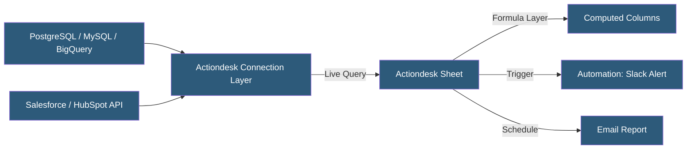

**Category:** Specialized Automation Platforms
**Difficulty:** Beginner
**Reading time:** 5 min read

---

Actiondesk is a spreadsheet-style business intelligence and automation tool that connects directly to databases and SaaS applications, presenting live data in a familiar spreadsheet interface without requiring data exports. It is designed for business analysts who need SQL-powered data access in a no-code, spreadsheet-like environment with built-in automation capabilities.

- **Data Connection** — a configured link to a database, data warehouse, or SaaS application
- **Live Sheet** — a spreadsheet tab pulling real-time data from connected sources via underlying SQL or API queries
- **Formula** — spreadsheet-style formulas applied to live data columns for on-the-fly calculations
- **Automation** — a configured workflow triggered by data conditions or schedules (alerts, Slack notifications, Airtable updates)
- **No-Export Model** — the design principle that data stays in the source and Actiondesk queries it directly
- **Scheduled Report** — a recurring export or notification sent automatically from a live sheet
- **Collaboration** — shared workbooks where multiple team members see the same live data

Actiondesk presents data in a spreadsheet grid, but unlike traditional spreadsheets, the underlying data source is a live database or SaaS API rather than in-memory cell values. When users open an Actiondesk sheet, the platform executes the configured queries against the connected sources and populates the grid with current results.

Connections to databases use standard SQL connectors (PostgreSQL, MySQL, Redshift, BigQuery, Snowflake). Users configure the query defining what data to show—either through a visual query builder or raw SQL. SaaS connections (Salesforce, HubSpot, Stripe) use pre-built API connectors that surface objects as queryable datasets.

Formula columns apply spreadsheet arithmetic, text operations, and aggregations to the live data, enabling analysts to add calculated metrics without modifying the source database. These formulas execute in Actiondesk's compute layer, not in the browser.

Automations monitor data conditions: when a metric crosses a threshold (e.g., daily signups drop below a target), Actiondesk triggers a configured action—sending a Slack message, updating an Airtable record, or sending an email with the relevant data. This event-driven behavior converts the live spreadsheet into an operational monitoring tool.

Team collaboration means everyone accessing the shared sheet sees the same live data, eliminating the version confusion of emailed spreadsheet copies.

- Operations teams monitoring live database KPIs in a familiar spreadsheet interface
- RevOps building sales pipeline views over Salesforce data without CRM report builder
- Finance pulling live PostgreSQL data for budget vs. actual analysis
- Alerting on business metric anomalies detected in live data
- Shared cross-functional dashboards where each team sees their relevant data layer

| Advantage | Disadvantage |
|-----------|--------------|
| No data export needed; queries source directly | Performance depends on source database responsiveness |
| Familiar spreadsheet interface reduces learning curve | Not a replacement for full BI tools for complex visualizations |
| Automations add operational workflows to reporting | Smaller connector library than Coefficient or Zapier |
| Team collaboration built-in with live shared data | Limited advanced formula support vs. Excel/Sheets |

- [Coefficient Spreadsheet Automation](coefficient-spreadsheet-automation.md)
- [Rows Spreadsheet with Integrations](rows-spreadsheet-with-integrations.md)
- [Parabola No-Code ETL](parabola-no-code-etl.md)

---
*Part of the [Specialized Automation Platforms](index.md) category · [Back to Master Index](../../index.md)*
