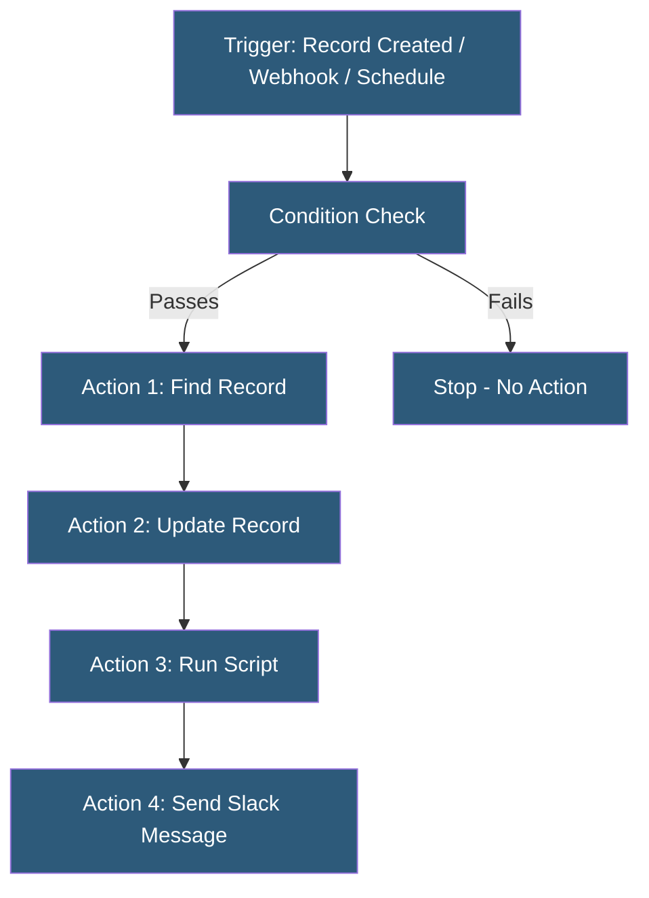

**Category:** Specialized Automation Platforms
**Difficulty:** Intermediate
**Reading time:** 6 min read

---

Airtable Automations is a native workflow engine built into the Airtable database platform, enabling users to automate repetitive tasks in response to record changes, schedules, form submissions, and external webhook events. It supports JavaScript scripting within automation steps, making it one of the most flexible built-in automation systems among no-code database tools.

- **Trigger** — the event that starts an automation (record created, record matches conditions, scheduled, webhook received)
- **Action** — a step in the automation that performs an operation (update record, create record, send email, run script)
- **Condition** — a filter applied to a trigger event that must be true for the automation to proceed
- **Run Script** — a JavaScript action step allowing arbitrary code execution with access to the Airtable API
- **Automation History** — a log of past runs with input/output data for each step, used for debugging
- **Test Action** — the ability to manually execute an automation with sample data before going live
- **Linked Record** — a reference field connecting records in different tables, which automation actions can traverse

Airtable Automations execute within Airtable's cloud infrastructure when a trigger event occurs. Record-based triggers use Airtable's internal change feed—when a record is created, updated to match a condition, or a specific field changes value, the trigger evaluates the condition filter. If the conditions pass, the automation steps execute sequentially.

Webhook triggers allow external services to fire Airtable automations by sending an HTTP POST to a unique URL. The webhook payload becomes available as variables in subsequent action steps, enabling bidirectional integration with external platforms.

Automation action steps share data through a variable system: each step produces outputs (found records, created record IDs, API response data) that subsequent steps reference using the "Insert data from previous steps" selector. This data flow model allows building multi-step workflows without scripting.

The Run Script action provides a JavaScript sandbox with access to the `base` object (Airtable's scripting API), HTTP fetch, and input/output variables from other automation steps. This is particularly powerful for conditional logic, data transformation, and API calls to services not natively supported by action types.

Pre-built integrations cover Slack, Microsoft Teams, Gmail, Outlook, Jira, Salesforce, and others, with each integration providing typed action forms. The Send HTTP Request action enables any REST API call, serving as a general-purpose external integration when no dedicated integration exists.

Automation run history provides a detailed audit trail with timestamps, trigger data, step outputs, and error messages, making debugging practical without external logging tools.

- Automatically assigning tasks to team members when a project record's status changes
- Sending customized email notifications when form submissions are received
- Syncing Airtable records to a CRM when deal stage reaches a threshold
- Running nightly data quality checks and flagging anomalies via script
- Triggering Airtable workflows from external systems via webhook

| Advantage | Disadvantage |
|-----------|--------------|
| Run Script action enables sophisticated custom logic | Automation steps run sequentially with no parallel branching |
| Built-in history and debugging tools | Free plan limited to 100 automation runs per month |
| Webhook trigger accepts any external HTTP POST | JavaScript sandbox lacks npm package access |
| No external platform required for many integrations | Complex multi-table automations can be hard to trace |

- [Airtable Scripting](airtable-scripting.md)
- [Notion Database Automation](notion-database-automation.md)
- [Pipedream Serverless Workflows](pipedream-serverless-workflows.md)

---
*Part of the [Specialized Automation Platforms](index.md) category · [Back to Master Index](../../index.md)*
