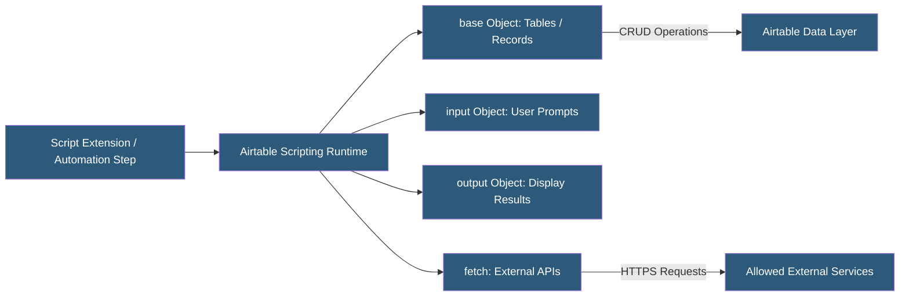

**Category:** Specialized Automation Platforms
**Difficulty:** Intermediate
**Reading time:** 6 min read

---

Airtable Scripting provides a JavaScript execution environment within Airtable bases, available as a script extension in the sidebar or as a Run Script action within Automations. It exposes a dedicated Airtable Scripting API that provides typed access to tables, records, fields, and views, enabling data manipulation, custom calculations, and external API integrations directly within the Airtable interface.

- **base** — the top-level scripting object representing the current Airtable base
- **table.selectRecordsAsync()** — the primary method for fetching records with optional field filtering and sorting
- **RecordId** — the unique identifier for each record, used for updates and cross-table references
- **input.textAsync()** — an interactive prompt allowing script users to provide runtime parameters
- **output.table()** — renders query results as a formatted table in the script output panel
- **fetch()** — the built-in HTTP client for calling external REST APIs from within a script
- **Remote Fetch Allowlist** — the security configuration specifying which external domains a script may call

The Airtable Scripting runtime is a sandboxed JavaScript environment using a subset of modern JS (ES2020, with async/await but no CommonJS modules or npm). Scripts run in the browser (for extensions) or on Airtable's servers (for automation Run Script actions), with the same API surface in both contexts.

Record retrieval uses an async cursor model. `table.selectRecordsAsync()` accepts an options object specifying which fields to load (loading only needed fields reduces payload size), filters, and sorts. The returned `QueryResult` object contains a `records` array. Since Airtable enforces field-level loading, unloaded fields return `undefined`—this is a common scripting pitfall.

Updates use `table.updateRecordAsync()` for single-record writes or `table.updateRecordsAsync()` for batch updates (up to 50 records per call). Creating records follows the same pattern. All mutation operations are async and must be awaited.

The `fetch()` function follows the browser Fetch API specification, supporting GET, POST, PUT, DELETE with custom headers and JSON bodies. An allowlist in the script extension settings controls which external domains are accessible, preventing unauthorized data exfiltration. The Airtable runtime automatically handles HTTPS; HTTP requests are blocked.

The interactive scripting model (input prompts, output panels) makes scripts usable by non-developers: a script can ask for a date range, process records, and display a summary table—functioning as a lightweight internal tool without building a full custom app.

- Bulk-updating records based on calculated values from multiple fields
- Deduplication: finding and merging duplicate records with configurable match criteria
- Calling an external geocoding API to populate latitude/longitude from address fields
- Generating formatted summary reports output as tables in the script panel
- Data migration: transforming records from one table structure to another

| Advantage | Disadvantage |
|-----------|--------------|
| Runs inside Airtable UI without external infrastructure | No npm package access limits third-party library use |
| Interactive prompts make scripts usable by non-developers | Script execution timeout limits long-running operations |
| Batch operations (50 records) improve performance | No persistent storage; state must be stored in Airtable fields |
| Same API in automation steps and sidebar extensions | Remote fetch requires explicit domain allowlist configuration |

- [Airtable Automations](airtable-automations.md)
- [Google Apps Script Automation](google-apps-script-automation.md)
- [Retool Database Integrations](retool-database-integrations.md)

---
*Part of the [Specialized Automation Platforms](index.md) category · [Back to Master Index](../../index.md)*
