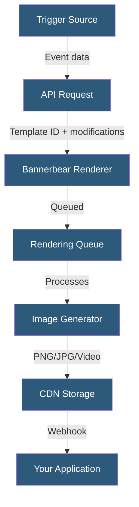

**Category:** Specialized Automation Platforms
**Difficulty:** Intermediate
**Reading time:** 6 min read

---

Bannerbear is an API-driven image and video generation service that dynamically produces visual assets from predefined templates. It integrates with no-code tools and custom code to automate the creation of social media graphics, OG images, and marketing collateral at scale.

- **Template** — A design file created in Bannerbear's editor with named, modifiable layers
- **Modification** — A JSON object specifying which layer to change and what value to inject
- **API Request** — An authenticated POST call that triggers image rendering with dynamic data
- **Webhook** — An HTTP callback sent when Bannerbear finishes rendering an asset
- **Collection** — A set of multiple templates rendered together from a single API call
- **Signed URL** — A time-limited URL for retrieving the generated image without authentication
- **Zapier/Make Integration** — Native connectors enabling no-code workflows to trigger Bannerbear

Bannerbear operates on a template-modification model. A designer creates a template in Bannerbear's browser-based editor, marking text layers, image layers, and shapes as dynamic. Each dynamic element is assigned a unique name. When your application needs an image, it sends a POST request to the `/v2/images` endpoint with the template UID and a `modifications` array. Each modification object references a layer by name and supplies the replacement value — text, an image URL, color, or visibility flag.

The rendering engine processes requests asynchronously. Bannerbear returns a `pending` status immediately with a unique image UID. Your system either polls the retrieval endpoint or registers a webhook URL that receives a POST when rendering completes. The finished asset is stored on Bannerbear's CDN and accessible via a permanent or signed URL.

Collections allow one API call to generate multiple image sizes simultaneously — useful for producing a full social media set from a single data payload. Synchronous rendering is available for lower-volume use cases where immediate response is preferred over throughput. Rate limits scale with plan tier, and the API supports batch queuing for high-volume campaigns.

- Automated Open Graph (OG) image generation for blog posts
- Personalized e-commerce product banners with dynamic pricing
- Social media content scheduled posts with current data
- Certificate and badge generation for course completions
- Dynamic thumbnail generation for video platforms

| Advantage | Disadvantage |
|-----------|--------------|
| No image editing code required | Templates must be rebuilt in Bannerbear editor |
| Scales to thousands of images via API | Asynchronous rendering adds latency |
| Native Zapier/Make integrations | Cost scales with image volume |
| CDN-hosted output with permanent URLs | Limited animation/video compared to full editors |

- [Placid Automated Design Generation](placid-automated-design-generation.md)
- [Abyssale Dynamic Image Automation](abyssale-dynamic-image-automation.md)
- [DocuGen Document Automation](docugen-document-automation.md)

---
*Part of the [Specialized Automation Platforms](index.md) category · [Back to Master Index](../../index.md)*
