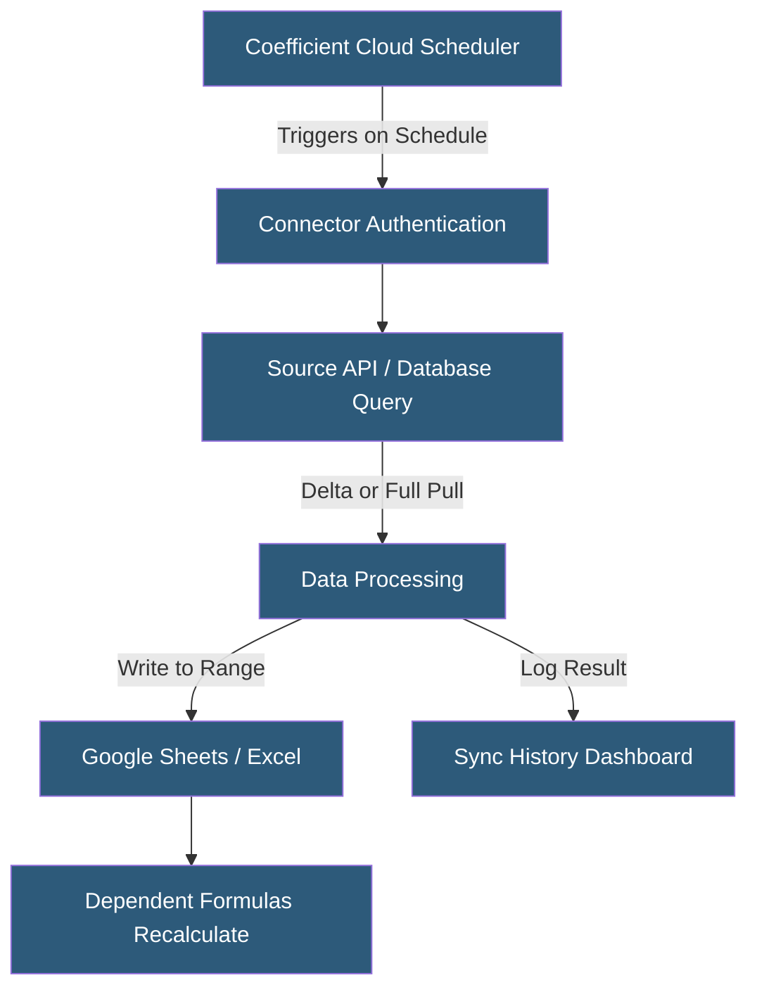

**Category:** Specialized Automation Platforms
**Difficulty:** Beginner
**Reading time:** 5 min read

---

Coefficient's live data sync capability enables continuous, scheduled synchronization between spreadsheets and source systems, ensuring business users always work with current operational data without manual exports or IT-dependent data pipelines. It transforms Google Sheets and Excel from static reporting tools into live operational dashboards connected directly to CRMs, databases, and SaaS platforms.

- **Sync Schedule** — the configured frequency at which Coefficient re-executes data imports (15 min, hourly, daily)
- **Incremental Sync** — an optimization that fetches only records modified since the last sync, reducing API calls
- **Full Refresh** — a sync mode that replaces all data in the destination range with a complete re-pull from the source
- **Append Mode** — a sync mode that adds new records to the bottom of existing data without overwriting
- **Sync Status** — a per-import status indicator showing last sync time, row count, and any errors
- **Sync Notification** — an email alert sent when a scheduled sync fails or produces an anomalous result
- **Cross-Sheet Reference** — the ability for formulas in other sheets to reference live-synced data ranges

Live data sync in Coefficient is driven by server-side scheduling. When a user configures an import with auto-refresh, Coefficient's backend registers a scheduled job tied to the import configuration. At the configured interval, the scheduler triggers an import execution using the stored connector credentials and query parameters—independent of whether the spreadsheet is open or the user is active.

For incremental syncs, Coefficient tracks the modification timestamp or record ID from the previous sync. On the next run, the connector query includes a filter restricting results to records modified after that checkpoint, dramatically reducing API calls and data transfer for large datasets. Full refresh mode, by contrast, truncates and replaces the destination range entirely.

When a sync completes, Coefficient writes data directly into the configured spreadsheet range via the Google Sheets API or Excel API. This triggers recalculation of any formulas referencing those ranges—VLOOKUP, SUMIF, charts, and pivot tables all update automatically, turning static reports into live dashboards.

Sync history is maintained in Coefficient's cloud dashboard, showing each import's execution log with timestamps, row counts, and error messages. This audit trail is useful for troubleshooting data freshness issues and confirming data governance compliance.

For databases, Coefficient executes parameterized SQL queries on the configured schedule, handling connection pooling and query timeout management transparently.

- Salesforce pipeline data refreshed hourly into a Google Sheets forecast model
- Daily revenue metrics synced from a PostgreSQL database into an executive dashboard
- HubSpot contact list refreshed for email marketing analysis without manual export
- Google Analytics metrics pulled nightly into a cross-channel performance spreadsheet
- Inventory levels synced from a warehouse management system for operations visibility

| Advantage | Disadvantage |
|-----------|--------------|
| Server-side scheduling works without user interaction | Minimum 15-minute refresh interval; not truly real-time |
| Incremental sync reduces API rate limit consumption | Large full-refresh imports can hit Google Sheets row limits |
| Sync history provides data lineage and troubleshooting | Connector credentials stored in Coefficient's cloud |
| Works in both Google Sheets and Excel | Excel sync requires Office 365 with web access |

- [Coefficient Spreadsheet Automation](coefficient-spreadsheet-automation.md)
- [Rows Spreadsheet with Integrations](rows-spreadsheet-with-integrations.md)
- [Google Apps Script Automation](google-apps-script-automation.md)

---
*Part of the [Specialized Automation Platforms](index.md) category · [Back to Master Index](../../index.md)*
