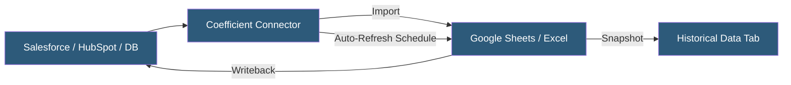

**Category:** Specialized Automation Platforms
**Difficulty:** Beginner
**Reading time:** 5 min read

---

Coefficient is a spreadsheet automation tool that connects Google Sheets and Excel to live data from CRMs, databases, APIs, and business applications, automatically refreshing data on schedules and enabling two-way syncing between spreadsheets and source systems. It targets business analysts and revenue operations teams who work primarily in spreadsheets but need real-time operational data.

- **Connector** — a pre-built integration to a data source (Salesforce, HubSpot, MySQL, BigQuery, etc.)
- **Import** — a configured data pull from a source connector into specific sheet cells/ranges
- **Auto-Refresh** — a scheduled re-execution of imports to keep spreadsheet data current
- **Writeback** — pushing data changes made in the spreadsheet back to the source system (CRM updates, database writes)
- **Snapshot** — a historical copy of an import preserved for trend analysis
- **Lookup** — a formula function that queries a connected data source in real-time without importing all data
- **GPT Copilot** — an AI assistant built into Coefficient for writing formulas and explaining data patterns

Coefficient installs as a Google Sheets add-on or Excel add-in. After installation, users authenticate their data source connectors via OAuth or API key within the Coefficient sidebar. Each connector exposes the source's data objects (Salesforce opportunities, HubSpot contacts, database tables) as importable datasets.

When configuring an import, users select which object and fields to pull, apply filters (e.g., only opportunities in stage "Proposal"), and choose the destination range in the spreadsheet. Coefficient executes the import, writing results as tabular data starting at the specified cell. Imports are registered in Coefficient's cloud backend, enabling scheduled auto-refresh.

Auto-refresh schedules range from every 15 minutes to daily, with the schedule stored server-side so refreshes happen even when the spreadsheet isn't open. Users receive email notifications for refresh failures.

The writeback feature is Coefficient's differentiator from simple data importers: users can edit CRM data directly in the spreadsheet and push changes back to Salesforce or HubSpot with a single button click, reducing the need to navigate CRM UIs for bulk updates.

Snapshots preserve dated copies of imported data in additional tabs, creating a built-in audit trail and enabling trend analysis over time within the same workbook.

- Live Salesforce pipeline reports in Google Sheets refreshed every hour automatically
- RevOps teams editing HubSpot deal data in bulk via spreadsheet writeback
- Marketing analysts pulling Google Analytics and ad platform data into a unified dashboard
- Finance teams reporting on live database query results without manual SQL exports
- Weekly snapshots of key metrics preserved automatically for historical comparison

| Advantage | Disadvantage |
|-----------|--------------|
| Keeps existing spreadsheet workflows with live data | Writeback limited to supported CRM/service connectors |
| Scheduled refresh works without user being present | Google Sheets performance degrades with very large imports |
| Two-way sync reduces CRM manual data entry | Pricing can be significant for large teams with many imports |
| No-code setup within familiar spreadsheet environment | Real-time lookups add latency to spreadsheet formulas |

- [Coefficient Live Data Sync](coefficient-live-data-sync.md)
- [Google Apps Script Automation](google-apps-script-automation.md)
- [Parabola No-Code ETL](parabola-no-code-etl.md)

---
*Part of the [Specialized Automation Platforms](index.md) category · [Back to Master Index](../../index.md)*
