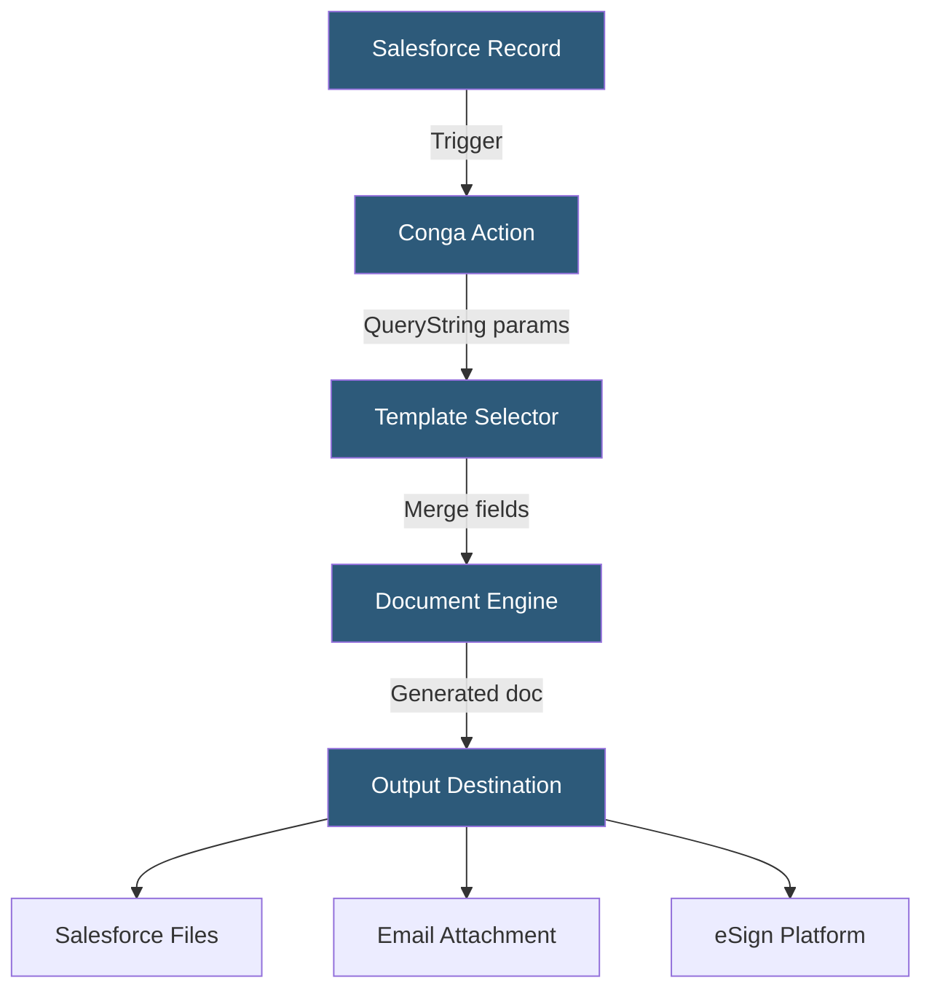

**Category:** Specialized Automation Platforms
**Difficulty:** Advanced
**Reading time:** 7 min read

---

Conga Composer is an enterprise document generation and contract lifecycle management platform built natively on Salesforce. It automates the creation of complex, data-rich documents — proposals, contracts, NDAs, and SOWs — by merging Salesforce records into professionally formatted templates.

- **Conga Template** — A Word, Excel, or PowerPoint file containing merge fields that map to Salesforce objects and fields
- **Conga Button/Action** — A Salesforce UI element triggering document generation from a record page
- **QueryString** — A URL parameter set controlling which data, template, and output action to use
- **Conga Batch** — Scheduled or event-driven bulk document generation across many records
- **eSign Integration** — Native connectors to DocuSign, Adobe Sign, and Conga Sign for post-generation signing
- **Conga Contracts** — The CLM (Contract Lifecycle Management) module for redlining and negotiation
- **Revenue Lifecycle Cloud** — Conga's broader platform encompassing CPQ, CLM, and billing

Conga Composer operates as a managed package inside Salesforce. A document generation process begins when a user clicks a Conga button on a Salesforce record or when an automation (Flow, Process Builder, or Apex trigger) fires a Conga action. The platform reads a QueryString that specifies which SOQL query to run for data, which template file to use, and what to do with the output.

Templates are authored in Microsoft Office applications using Conga's merge field syntax — `{{SF:FieldAPIName}}` for standard fields and `{{TR:RelatedObject.Field}}` for related records. Table repeating regions iterate over child records, inserting one row per related object. Conditional formatting hides sections based on field values.

The rendering engine fetches all required Salesforce data, injects it into the template, and produces the output document. Complex SOQL joins allow pulling data from multiple related objects simultaneously. The output can be saved as a Salesforce file, attached to the originating record, emailed, or routed to an e-signature workflow.

Conga Batch extends this for high-volume scenarios — it processes a Salesforce report or list view, generating one document per record and delivering them in bulk. This is essential for contract renewal campaigns or regulatory reporting.

- Sales proposal and SOW generation from Salesforce Opportunities
- Contract generation tied to Salesforce CLM workflows
- Customer-facing quote documents merged from CPQ line items
- Compliance reports pulled from audit object records
- Bulk renewal notices from subscription records

| Advantage | Disadvantage |
|-----------|--------------|
| Deep Salesforce native integration with SOQL access | Requires Salesforce license and admin expertise |
| Handles complex multi-object data relationships | Template syntax learning curve is steep |
| Enterprise eSign integrations built-in | Cost is significant for enterprise licensing |
| Batch generation at scale | Configuration via QueryString is error-prone |

- [PandaDoc Workflow Automation](pandadoc-workflow-automation.md)
- [DocuGen Document Automation](docugen-document-automation.md)
- [Retool Database Integrations](retool-database-integrations.md)

---
*Part of the [Specialized Automation Platforms](index.md) category · [Back to Master Index](../../index.md)*
