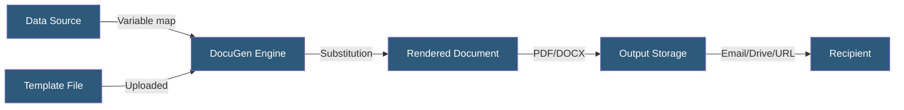

**Category:** Specialized Automation Platforms
**Difficulty:** Intermediate
**Reading time:** 6 min read

---

DocuGen is a document generation platform that produces PDFs and Word documents from templates using data from spreadsheets, forms, or API calls. It is widely used for automating contracts, invoices, reports, and compliance documents without requiring custom development.

- **Template** — A Word or Google Docs file with placeholder variables enclosed in double curly braces `{{variable}}`
- **Placeholder** — A named token in the template replaced with runtime data during generation
- **Data Source** — A Google Sheet, Airtable base, form submission, or API payload supplying variable values
- **Output Format** — PDF or DOCX file produced after variable substitution
- **Conditional Block** — A template section rendered only when a logical condition evaluates to true
- **Repeating Table** — A table row or section that loops over an array of data objects
- **Merge Tag** — A special placeholder for images, signatures, or formatted dates

DocuGen processes documents by scanning templates for placeholder tokens and replacing them with values from the supplied data. Templates are standard Word or Google Docs files, which means existing company documents can be converted into templates by adding `{{placeholder}}` syntax without redesigning layouts.

When a generation job is triggered — via Google Sheets add-on, Zapier action, API call, or form submission — DocuGen reads the data row, maps each column to its matching placeholder, and processes the template sequentially. Conditional blocks use `{{#if condition}}...{{/if}}` syntax to include or omit sections based on data values. Repeating tables iterate over child arrays, producing one row per data object — essential for itemized invoices or multi-line contracts.

The resulting document is saved to Google Drive, sent by email, uploaded to a webhook URL, or returned as a base64-encoded string in the API response. For high-volume use cases, batch generation processes an entire spreadsheet in one operation. DocuGen maintains an audit log of generated documents with metadata, timestamps, and download links, supporting compliance workflows.

- Automated contract generation from CRM deal data
- Invoice production from time-tracking or order data
- Compliance report generation from audit spreadsheets
- Offer letter automation in HR workflows
- Certificate of completion generation for training platforms

| Advantage | Disadvantage |
|-----------|--------------|
| Uses existing Word/Google Docs templates | Complex layouts can break with dynamic content length |
| No-code via Google Sheets add-on | PDF output styling limited by source document format |
| Conditional and repeating content support | Less advanced than dedicated contract platforms |
| Audit log for compliance tracking | Limited real-time collaboration on templates |

- [Conga Document Generation](conga-document-generation.md)
- [PandaDoc Workflow Automation](pandadoc-workflow-automation.md)
- [Bannerbear Automated Image Generation](bannerbear-automated-image-generation.md)

---
*Part of the [Specialized Automation Platforms](index.md) category · [Back to Master Index](../../index.md)*
