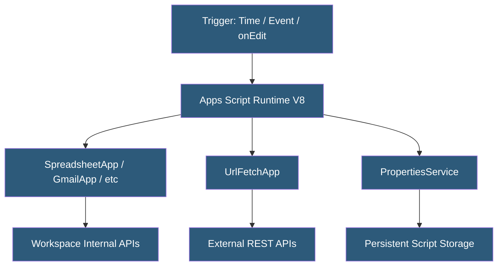

**Category:** Specialized Automation Platforms
**Difficulty:** Intermediate
**Reading time:** 6 min read

---

Google Apps Script is a JavaScript-based scripting platform hosted on Google's infrastructure that automates and extends Google Workspace applications including Sheets, Docs, Drive, Gmail, Calendar, and Forms. It provides server-side execution with direct API access to all Workspace services, making it the primary automation tool for the Google Workspace ecosystem.

- **Script Project** — a collection of script files attached to a Google Workspace document or standalone in Drive
- **Bound Script** — a script attached to a specific Sheets, Docs, or Forms file, with privileged access to that document
- **Standalone Script** — a script project in Drive independent of any specific document
- **Trigger** — an event binding that executes a function automatically (time-based, document event, form submit)
- **Services** — built-in classes providing access to Workspace APIs (SpreadsheetApp, GmailApp, DriveApp, etc.)
- **UrlFetchApp** — the service for making external HTTP requests, enabling integration with any REST API
- **Execution Quota** — daily limits on script runtime, API calls, and emails that vary by Workspace plan

Apps Script executes JavaScript (ES2019+ via the V8 engine) on Google's servers, with each execution running in an isolated container. Scripts authenticate to Google APIs using the running user's credentials via OAuth 2.0 scope declarations—scopes are declared in the project manifest and approved by the user or admin at first execution.

The Workspace service layer (SpreadsheetApp, GmailApp, etc.) wraps Google's internal APIs with a synchronous JavaScript interface. Unlike direct REST calls, these services handle authentication, batching, and retry transparently. However, each method call can count against per-execution quotas, so developers use batch patterns—reading all needed data upfront, processing in memory, and writing results in a single operation.

Time-based triggers execute functions on schedules from every minute to monthly intervals. Simple triggers (onEdit, onOpen, onFormSubmit) fire automatically for document events but run with limited permissions. Installable triggers run with the installing user's full permissions and can perform actions like sending emails.

UrlFetchApp enables outbound HTTP requests with full control over method, headers, and payload, allowing Apps Script to integrate with Slack, Salesforce, Airtable, or any REST/JSON API. The service automatically handles HTTPS and follows redirects.

The PropertiesService provides a key-value store persisting between script executions, used for OAuth tokens, configuration values, and cross-execution state. The LockService prevents concurrent script execution on shared resources like spreadsheets.

- Automating Google Sheets data consolidation from multiple tabs on a schedule
- Sending personalized Gmail campaigns using Sheets as a mail merge data source
- Processing Google Forms submissions—validating, enriching, and routing responses
- Building custom Workspace add-ons with sidebar UIs and menu items
- Syncing data between Google Sheets and external databases via REST APIs

| Advantage | Disadvantage |
|-----------|--------------|
| Free for all Google accounts with Workspace | 6-minute maximum execution time per run |
| Direct synchronous access to all Workspace APIs | Strict daily quotas on emails, API calls, and triggers |
| No server provisioning required | Debugging requires Apps Script IDE; limited tooling |
| Deploy as Workspace Add-ons via Google Marketplace | Runs only on Google infrastructure; no self-hosting |

- [Google Workspace Automation](google-workspace-automation.md)
- [Microsoft Power Automate](microsoft-power-automate.md)
- [Airtable Scripting](airtable-scripting.md)

---
*Part of the [Specialized Automation Platforms](index.md) category · [Back to Master Index](../../index.md)*
