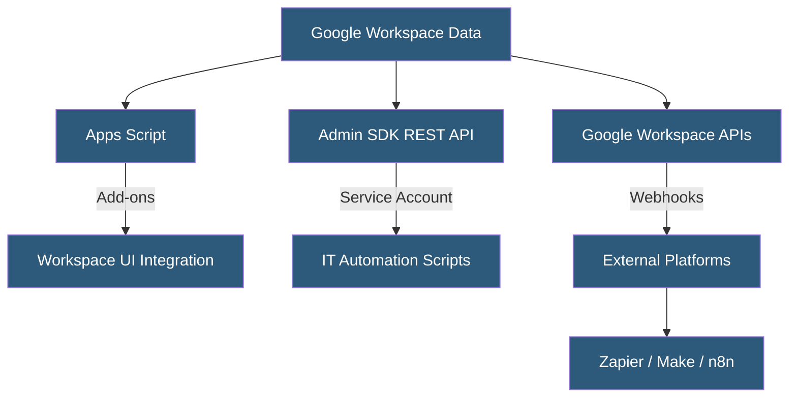

**Category:** Specialized Automation Platforms
**Difficulty:** Intermediate
**Reading time:** 6 min read

---

Google Workspace Automation encompasses the full ecosystem of tools, APIs, and platforms available for automating workflows across Gmail, Drive, Docs, Sheets, Calendar, Chat, and Meet. Beyond Apps Script, it includes the Admin SDK for IT automation, Google Chat bots, AppSheet for no-code apps, and integration with external platforms via Workspace Marketplace add-ons.

- **Admin SDK** — REST APIs for automating Workspace user management, device policies, and audit logs
- **Google Chat Bot** — an application integrated into Google Chat that responds to messages, slash commands, and card interactions
- **AppSheet** — Google's no-code app builder that uses Sheets and Drive as data sources
- **Workspace Marketplace** — the distribution channel for Workspace add-ons and third-party integrations
- **Service Account** — a non-human Google identity used for server-to-server API automation without user interaction
- **Domain-Wide Delegation** — a mechanism allowing a service account to act as any user in the domain
- **Google Workspace Events API** — an event subscription service for receiving real-time notifications of Workspace resource changes

Workspace automation operates at three levels: user-level scripting via Apps Script, IT administration via the Admin SDK, and application-level integration via individual product APIs (Gmail API, Drive API, Calendar API, etc.).

The Admin SDK provides REST endpoints for managing users, groups, organizational units, and Chrome device policies programmatically. Combined with service account credentials and domain-wide delegation, IT teams can build fully automated provisioning pipelines—creating users, assigning licenses, setting up Drive shared folders, and enrolling devices without manual console interaction.

Google Chat bots are built using Google Cloud Functions or Cloud Run with the Chat API. Bots receive events via HTTP callbacks (messages directed at the bot, card click events, space membership changes) and respond with structured card JSON. Interactive cards support form elements, allowing bots to collect user input directly in Chat.

The Google Workspace Events API (2023+) provides push subscriptions for real-time change notifications on Spaces, Meetings, and Calendars without polling. This replaces the older Google Drive push notifications pattern with a unified subscription model supporting topic-based filtering.

AppSheet creates data-connected apps from Sheets without code, adding mobile UIs, workflows, and automations on top of spreadsheet data. AppSheet Automation (formerly AppSheet Bots) runs background processes triggered by data changes, applying formulas and calling REST APIs.

External platforms like Zapier, Make, and n8n connect Workspace to non-Google services using OAuth-authenticated connector libraries, while Pub/Sub integrations allow Workspace events to fan out to cloud services.

- Automated employee onboarding: create users, provision Drive folders, send welcome emails
- Google Chat bots for IT helpdesk triage and ticket creation
- Real-time calendar sync between Workspace and Salesforce via Events API
- AppSheet mobile apps for field teams backed by Google Sheets data
- Automated Workspace audit log analysis and security alerting

| Advantage | Disadvantage |
|-----------|--------------|
| All automation tools free with Workspace subscription | Admin SDK automation requires careful permission scoping |
| Real-time event subscriptions via Workspace Events API | Service account domain delegation is a high-privilege configuration |
| AppSheet eliminates need for custom mobile development | AppSheet automation has limited programming expressiveness |
| Chat bots use standard HTTP webhooks for easy integration | Chat bot development requires Cloud hosting for callbacks |

- [Google Apps Script Automation](google-apps-script-automation.md)
- [Notion API Automation](notion-api-automation.md)
- [Airtable Automations](airtable-automations.md)

---
*Part of the [Specialized Automation Platforms](index.md) category · [Back to Master Index](../../index.md)*
