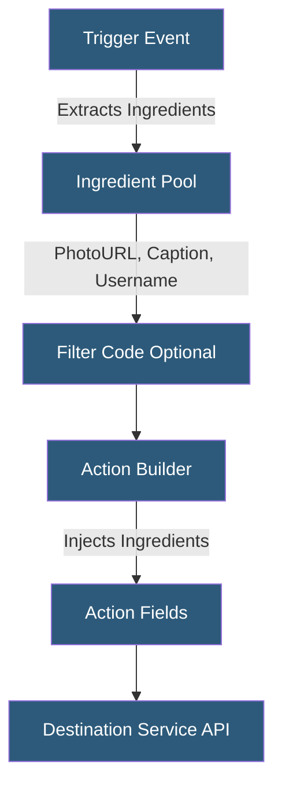

**Category:** Specialized Automation Platforms
**Difficulty:** Beginner
**Reading time:** 5 min read

---

IFTTT applets are the fundamental automation units that connect trigger events to resulting actions across integrated services. Services represent the connected platforms—from social media to smart home devices—that expose their functionality through IFTTT's standardized trigger and action framework. Understanding the applet/service model is key to building effective consumer automations.

- **Published Applet** — a community-shared automation template users can activate without configuration
- **Personal Applet** — a custom automation built and owned by a specific user account
- **Trigger Fields** — configurable parameters that refine when a trigger fires (e.g., specific hashtag, temperature threshold)
- **Action Fields** — the specific data points written or sent when an action executes
- **Ingredient** — a dynamic data value from the trigger (e.g., {{PhotoURL}}, {{EventTitle}}) inserted into action fields
- **Service Authentication** — OAuth tokens allowing IFTTT to act on behalf of users in connected services
- **Applet Status** — active, paused, or error states tracked per applet per user

Each IFTTT service exposes a set of triggers and actions through IFTTT's platform API. Service developers define the trigger schema—what events are available, what fields users can configure, and what ingredients (dynamic data) each trigger produces. Similarly, action schemas define what the action does and what fields can be populated with trigger ingredients.

When a user activates an applet, IFTTT stores the trigger configuration and begins monitoring that service on the user's behalf. For REST-based services, IFTTT polls an endpoint or receives a webhook callback. When the trigger condition is met, IFTTT extracts the defined ingredients from the trigger payload—these are named variables like `{{Title}}`, `{{ImageURL}}`, or `{{OccurredAt}}`.

The ingredient system is what makes applets composable: a trigger producing a URL ingredient can feed that URL directly into an action that saves a file, sends a message, or updates a spreadsheet. Pro+ users can manipulate ingredients with JavaScript filter code, performing string operations, conditionals, and data transformations before the action executes.

IFTTT's service catalog includes official integrations built by the IFTTT team, developer-published integrations from companies integrating their own products, and legacy integrations that may have varying reliability. The platform enforces rate limits on action execution to prevent abuse and manages token refresh automatically when OAuth credentials expire.

- Combining weather trigger ingredients into formatted daily briefing messages
- Using location-based triggers with smart home action ingredients
- Chaining multiple actions from a single trigger in Pro multi-step applets
- Building applet templates for teams using IFTTT for Business
- Automating content archiving with timestamp and source ingredients

| Advantage | Disadvantage |
|-----------|--------------|
| Ingredient system enables dynamic, data-driven actions | Ingredient availability depends on service integration quality |
| Published applets drastically lower activation friction | Service integrations can break when third-party APIs change |
| Multi-step applets allow complex action sequences (Pro) | No looping or iteration within a single applet |
| Service auth is managed automatically | Users cannot inspect or modify service auth flow |

- [IFTTT Consumer Automation](ifttt-consumer-automation.md)
- [Shortcuts App Actions](shortcuts-app-actions.md)
- [Airtable Automations](airtable-automations.md)

---
*Part of the [Specialized Automation Platforms](index.md) category · [Back to Master Index](../../index.md)*
