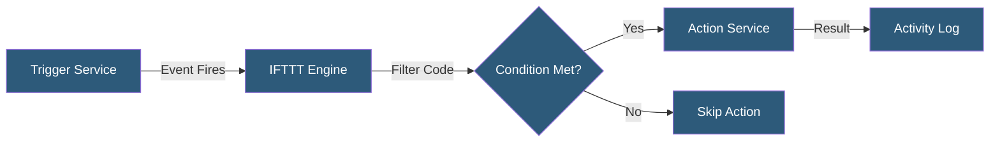

**Category:** Specialized Automation Platforms
**Difficulty:** Beginner
**Reading time:** 5 min read

---

IFTTT (If This Then That) is a consumer-focused automation platform that connects web services, smart home devices, and mobile apps through simple conditional logic. It enables non-technical users to build integrations between hundreds of services without writing code. IFTTT pioneered the "trigger-action" automation model that influenced the entire no-code integration space.

- **Applet** — a pre-built or custom automation connecting two or more services via trigger and action
- **Trigger** — the event in a source service that initiates the applet (e.g., new tweet, weather change)
- **Action** — the resulting task performed in the destination service when a trigger fires
- **Service** — a connected platform or device (e.g., Gmail, Philips Hue, Google Sheets)
- **Filter Code** — JavaScript snippets (Pro+ feature) that add conditional logic between trigger and action
- **Queries** — data lookups that allow applets to pull additional context before executing actions
- **Webhooks** — a service within IFTTT allowing HTTP requests to trigger or be triggered by applets

IFTTT operates on a polling and webhook hybrid model. For most services, IFTTT polls the trigger service at intervals (typically every 15 minutes on the free tier, faster on Pro) to check if the trigger condition has been met. When a trigger fires, IFTTT's backend evaluates any filter code and then calls the action service's API to perform the configured task.

Authentication between IFTTT and third-party services uses OAuth 2.0, where users grant IFTTT permission to act on their behalf. Service integrations are maintained by either IFTTT or the service providers themselves through the IFTTT Platform API, which lets companies publish their services natively.

The Pro and Pro+ tiers unlock multi-step applets (chaining multiple actions), faster polling intervals, and JavaScript-based filter code that gives users programmatic control over whether and how actions execute. Webhooks ("Maker Webhooks") allow developers to integrate custom applications by sending or receiving HTTP POST/GET requests, effectively turning any HTTP-capable system into a trigger or action endpoint.

IFTTT maintains a marketplace of millions of pre-built applets, allowing users to activate community-created automations with a single tap. The platform handles rate limiting, error retries, and logging automatically, abstracting away the complexity of direct API integration.

- Automatically saving Instagram photos to Google Drive
- Turning smart lights on/off based on sunrise/sunset or location
- Logging fitness tracker data to a Google Sheet
- Sending SMS alerts when a package is delivered
- Cross-posting content from one social platform to another

| Advantage | Disadvantage |
|-----------|--------------|
| Zero coding required for basic automations | Polling delays (up to 15 min on free tier) |
| Huge library of 700+ service integrations | Limited logic complexity without Pro+ |
| Smart home device support is extensive | Not suitable for business-critical workflows |
| Low cost for personal use | Data flows through IFTTT servers (privacy concern) |

- [IFTTT Applets and Services](ifttt-applets-and-services.md)
- [Microsoft Power Automate](microsoft-power-automate.md)
- [Pipedream Serverless Workflows](pipedream-serverless-workflows.md)

---
*Part of the [Specialized Automation Platforms](index.md) category · [Back to Master Index](../../index.md)*
