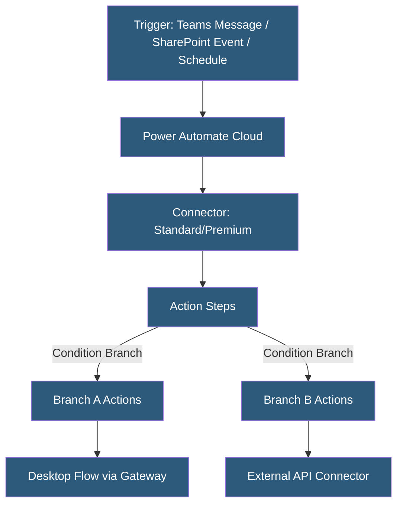

**Category:** Specialized Automation Platforms
**Difficulty:** Intermediate
**Reading time:** 6 min read

---

Microsoft Power Automate (formerly Microsoft Flow) is a cloud-based automation platform that connects Microsoft 365 services, Azure resources, and hundreds of third-party applications through low-code workflows. It is the automation component of the Microsoft Power Platform, tightly integrated with SharePoint, Teams, Dynamics 365, and the broader enterprise Microsoft ecosystem.

- **Cloud Flow** — a workflow running in Microsoft's cloud, triggered by events or schedules
- **Desktop Flow** — an RPA (Robotic Process Automation) workflow controlling a Windows desktop via the Power Automate Desktop client
- **Connector** — a pre-built integration to a specific service (Standard, Premium, or Custom)
- **Trigger** — the event that initiates a flow (manual, scheduled, automated on a service event)
- **Action** — a step within a flow that performs an operation in a connected service
- **Expression** — a formula language (based on Azure Logic Apps expression language) for data manipulation
- **Environment** — an isolated workspace in Microsoft Dataverse for organizing and governing flows

Power Automate Cloud Flows execute on Microsoft Azure infrastructure and are triggered by events from connected services, schedules, or manual invocations. The platform uses a connector model inherited from Azure Logic Apps—each connector wraps a REST API with authentication, schema definitions, and a library of trigger/action pairs.

Standard connectors (included with Microsoft 365 licenses) cover the core Microsoft services. Premium connectors—covering Salesforce, SAP, ServiceNow, and others—require a Power Automate Per-User or Per-Flow license. Custom connectors allow organizations to wrap any OpenAPI-documented REST API, making any internal service accessible within flows.

Expressions use a formula syntax drawing from Azure Functions expression language, with functions for string manipulation, date calculations, array operations, and JSON parsing. The `outputs()`, `triggerBody()`, and `variables()` functions let flows reference data from anywhere in the flow's execution context.

Power Automate Desktop (PAD) extends automation to legacy desktop applications through UI automation (simulating mouse clicks and keyboard input), screen scraping, and OCR. Desktop flows run on-premises via an on-premises data gateway, connecting local machines to cloud-orchestrated workflows. This makes PAD suitable for automating Excel desktop, SAP GUI, and mainframe terminal interfaces.

Approvals, a native Power Automate feature, allow flows to pause and route documents or requests to named approvers via Teams or email, resuming execution when the approval decision is recorded.

- Automating SharePoint document approval workflows with Teams notifications
- Syncing Dynamics 365 CRM data to Excel reports on a schedule
- Robotic process automation of legacy ERP systems using Desktop flows
- Sending adaptive card notifications to Teams channels on business events
- Building self-service IT request portals integrated with ServiceNow tickets

| Advantage | Disadvantage |
|-----------|--------------|
| Deep Microsoft 365/Azure ecosystem integration | Premium connectors require additional licensing costs |
| RPA Desktop flows extend automation to legacy apps | Complex flows with many branches become hard to maintain |
| Governance and DLP policies via Power Platform admin | Expression syntax has a steep learning curve |
| Approvals and adaptive cards built-in | Non-Microsoft service integrations are secondary |

- [Power Automate Desktop RPA](power-automate-desktop-rpa.md)
- [Google Apps Script Automation](google-apps-script-automation.md)
- [Pipedream Serverless Workflows](pipedream-serverless-workflows.md)

---
*Part of the [Specialized Automation Platforms](index.md) category · [Back to Master Index](../../index.md)*
