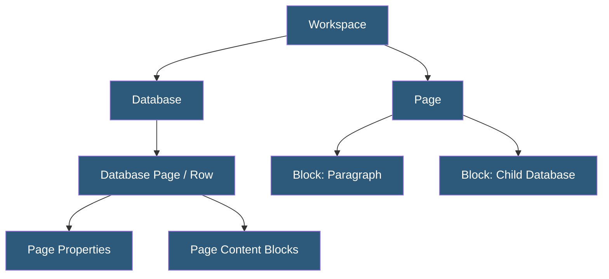

**Category:** Specialized Automation Platforms
**Difficulty:** Intermediate
**Reading time:** 6 min read

---

The Notion API is a REST interface that enables programmatic access to Notion workspaces—reading, creating, and updating pages, databases, blocks, and users. It powers integrations ranging from simple data syncs to full-featured Notion-backed applications, with support for both internal integrations (personal/team tooling) and public integrations distributed via the Notion integrations gallery.

- **Integration** — an API client (bot) granted access to specific Notion pages and databases via connection
- **Internal Integration Token** — a secret token for accessing your own workspace programmatically
- **Public Integration** — an OAuth 2.0 integration distributed to other Notion users, with their explicit authorization
- **Block** — the fundamental content unit in Notion (paragraphs, headings, code, databases, images)
- **Database** — a structured collection of pages with typed properties (text, number, select, date, relation, etc.)
- **Query Filter** — a structured filter object for retrieving database entries matching specific property conditions
- **Webhook (unofficial)** — Notion lacks native webhooks; polling or third-party tools (Zapier, Make) bridge this gap

The Notion API uses a block-based data model where everything—text, images, tables, embedded databases—is a block with a type, unique ID, parent reference, and type-specific content. Pages are blocks that can contain child blocks, and databases are specialized pages containing database-page children.

Authentication uses bearer tokens. Internal integrations receive a static token from the Notion developer portal, while public integrations implement OAuth 2.0 flows to obtain per-workspace tokens. Tokens must be kept secret and never exposed client-side.

Database operations are the most common API use case. The `POST /databases/{id}/query` endpoint accepts filter and sort objects to retrieve matching pages. Filters support compound AND/OR logic across all property types. Property values are updated via `PATCH /pages/{id}`, passing the property name and a typed value object.

The Notion SDK (official JavaScript/TypeScript and community Python packages) wraps the REST API with typed interfaces, pagination helpers, and retry logic. The SDK handles cursor-based pagination automatically, collecting all results when iterating large databases.

A significant limitation is the absence of native webhooks—the API offers no push notifications for data changes. Automation platforms work around this by polling databases on schedules (Zapier, Make, n8n) or using unofficial third-party webhook bridges. The Notion API rate limit is 3 requests per second per integration, and large block appends must be chunked to respect the 100-block-per-request limit.

- Syncing CRM data from Salesforce or HubSpot into a Notion database
- Auto-generating project status pages from task database entries
- Building dashboards that pull Notion data into external analytics tools
- Publishing Notion pages as website content via a Next.js frontend
- Automating meeting notes creation with pre-populated templates

| Advantage | Disadvantage |
|-----------|--------------|
| Rich block model enables sophisticated content structures | No native webhooks; must poll for changes |
| Official SDK reduces boilerplate for common operations | API rate limits (3 req/sec) constrain high-frequency automation |
| Database query filters cover complex property conditions | Block content retrieval is recursive and verbose |
| Integration permissions are scoped per-page by users | Property type schema can be complex for developers new to Notion |

- [Notion Database Automation](notion-database-automation.md)
- [Airtable Automations](airtable-automations.md)
- [Google Apps Script Automation](google-apps-script-automation.md)

---
*Part of the [Specialized Automation Platforms](index.md) category · [Back to Master Index](../../index.md)*
