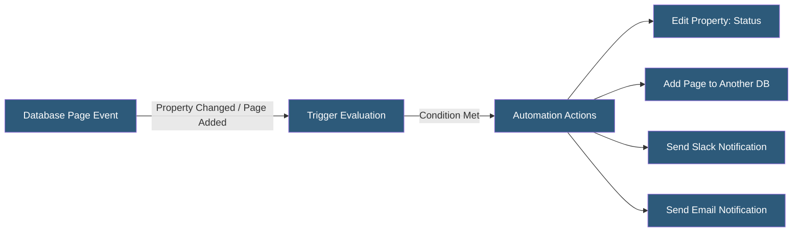

**Category:** Specialized Automation Platforms
**Difficulty:** Intermediate
**Reading time:** 5 min read

---

Notion database automation combines native in-app automations (triggered by database property changes) with external API-driven workflows to create dynamic, self-updating knowledge bases and project management systems. Notion's native automations launched in 2023, enabling trigger-action rules without leaving the Notion interface, while the API supports more complex logic through external platforms.

- **Database Trigger** — a native Notion rule that fires when a page property changes, a page is added, or a specific condition is met
- **Automation Action** — what happens when a trigger fires: add a page, edit a property, send a Slack/email notification
- **Formula Property** — a calculated database column using Notion's formula syntax for derived values
- **Rollup Property** — a property that aggregates values from related database entries via a Relation property
- **Relation Property** — a typed link between entries in two databases, enabling relational data modeling
- **Filter View** — a saved database view with persistent filters and sorts, used to segment automation targets
- **Linked Database** — a reference to a database displayed in another page context, sharing the same underlying data

Notion's native database automations evaluate trigger conditions whenever a database changes. Triggers can be "page added," "page property edited" (any property or a specific one), or property value conditions ("when Status equals Done"). Multiple conditions can be combined with AND logic.

Actions executed by native automations include editing a property (setting a value, clearing it, assigning today's date), creating a new page in another database with pre-filled properties, or sending a notification to Slack or via email. Native automations run within Notion's cloud infrastructure with no external dependencies.

For more complex logic—branching, loops, multi-database orchestration, or integration with non-Notion systems—external automation platforms connect via the Notion API. Zapier and Make poll Notion databases for changes and trigger multi-step workflows. n8n's Notion node supports both trigger polling and direct API operations with full database CRUD.

Formula properties enable computed columns—deriving values from other properties using Notion's formula language. Common patterns include calculating days until a deadline, generating status badges, or formatting text composites. Rollup properties aggregate related database data: summing numbers, counting relations, or finding date ranges across linked records.

The relational database model (Relation + Rollup) allows building normalized data structures within Notion, with automation rules that maintain referential integrity and propagate updates across linked databases.

- Auto-assigning tasks when a project status changes to "In Progress"
- Creating invoice records in a billing database when deal status reaches "Closed Won"
- Sending Slack alerts when a high-priority bug's status doesn't change within 24 hours
- Rolling up project budget actuals from task-level time entries
- Generating weekly summary pages populated from database data via API

| Advantage | Disadvantage |
|-----------|--------------|
| Native automations require no external platform | Native automation action types are limited (no complex logic) |
| Formula and Rollup handle many computed needs natively | No native webhook; external automations must poll |
| Relational model enables normalized data structures | Formula language is not full-featured (no regex, limited functions) |
| Native Slack/email integration in automations | Automation history and debugging is minimal in the UI |

- [Notion API Automation](notion-api-automation.md)
- [Airtable Automations](airtable-automations.md)
- [Pipedream Serverless Workflows](pipedream-serverless-workflows.md)

---
*Part of the [Specialized Automation Platforms](index.md) category · [Back to Master Index](../../index.md)*
