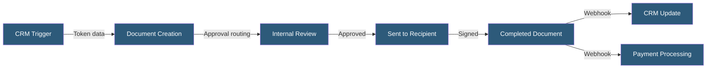

**Category:** Specialized Automation Platforms
**Difficulty:** Intermediate
**Reading time:** 6 min read

---

PandaDoc is a document workflow platform combining proposal creation, contract management, e-signatures, and payment collection in a single system. Its automation capabilities span CRM-triggered document generation, approval routing, and post-signature workflows that connect to downstream business systems.

- **Document Template** — A reusable document structure with tokens, tables, and interactive blocks
- **Token** — A `$[Variable.Name]` placeholder replaced with CRM or form data at send time
- **Workflow** — A sequence of actions triggered by document events (sent, viewed, signed, paid)
- **Approval Chain** — A configured sequence requiring internal sign-offs before a document is sent
- **Roles** — Recipient positions in the signing order, enabling sequential or parallel signature collection
- **Payment Block** — A built-in payment element allowing signers to pay at the moment of signature
- **API Integration** — REST endpoints for creating, sending, and monitoring documents programmatically

PandaDoc document workflows start with a template containing fixed content, dynamic tokens, fillable form fields, and signature blocks. Tokens follow the `$[RecipientFirst.Name]` convention and are populated from CRM data, manual input, or API payload when the document is created.

Approval workflows route the draft through configured reviewers before it reaches the external recipient. Each approver can comment, request changes, or approve. Only after all approvals clear does the system allow sending. The platform tracks recipient engagement — page views, time spent, and scroll depth — giving senders visibility into buyer interest.

Signing is handled via PandaDoc's built-in legally binding e-signature engine, which supports sequential signing (signer 2 notified only after signer 1 completes) and parallel signing for simultaneous collection. After completion, PandaDoc fires webhook events to connected systems — updating CRM deal stages, creating invoices in billing platforms, or notifying Slack channels.

The REST API allows developers to create documents from templates programmatically by submitting a recipient list and token map, automating entire contract factories for high-volume SaaS or services businesses.

- Sales proposal creation with interactive pricing tables
- Contract generation triggered from closed CRM deals
- MSA and NDA workflows with approval chains
- Onboarding agreements with payment collection at signing
- HR offer letter automation with sequential signing

| Advantage | Disadvantage |
|-----------|--------------|
| End-to-end document lifecycle in one platform | Can be expensive for high document volumes |
| Interactive pricing tables and payment blocks | Template editor less flexible than full design tools |
| Deep CRM integrations with HubSpot and Salesforce | Approval workflows limited on lower tiers |
| Legally binding e-signature included | Complex multi-party routing requires advanced setup |

- [DocuGen Document Automation](docugen-document-automation.md)
- [Conga Document Generation](conga-document-generation.md)
- [Pipedream Serverless Workflows](pipedream-serverless-workflows.md)

---
*Part of the [Specialized Automation Platforms](index.md) category · [Back to Master Index](../../index.md)*
