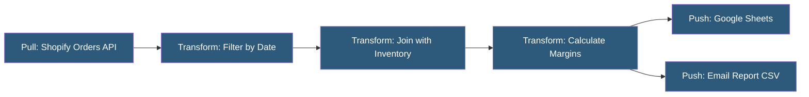

**Category:** Specialized Automation Platforms
**Difficulty:** Intermediate
**Reading time:** 5 min read

---

Parabola is a no-code data workflow automation platform designed for operations and e-commerce teams, enabling users to build automated data pipelines that pull from APIs, spreadsheets, and databases, transform the data visually, and push results to destinations without writing code. It focuses on recurring data operations that would otherwise require manual spreadsheet work or custom ETL development.

- **Step** — a processing node in the workflow canvas (data source, transformation, or destination)
- **Flow** — a complete Parabola workflow from source to destination, runnable manually or on a schedule
- **Pull Step** — a data source step (CSV upload, API call, Google Sheets, database query, Shopify, etc.)
- **Push Step** — a data destination step that writes transformed data to a service or file
- **Transform Step** — an operation node applying a data transformation (filter, deduplicate, join, formula, etc.)
- **Formula** — a spreadsheet-style expression language for creating computed columns in transform steps
- **Run History** — a log of past flow executions with row counts, errors, and exported file downloads

Parabola workflows are built on a drag-and-drop canvas where data flows left-to-right through a series of connected steps. Each step receives a tabular data set from its upstream step, applies its transformation, and passes the result downstream—similar to a visual SQL pipeline.

Pull steps connect to data sources via pre-built integrations: Shopify, Amazon, Google Sheets, CSV files, REST APIs with pagination support, FTP/SFTP servers, and databases via direct connectors. API steps support authentication, pagination configuration, and JSON path extraction to normalize nested API responses into flat tables.

Transformation steps cover the full range of spreadsheet-equivalent operations: filtering rows, selecting/renaming columns, calculating formula columns (using Parabola's spreadsheet formula syntax), joining two data sets by a key column, pivoting, unpivoting, and deduplicating. The visual canvas makes the transformation logic self-documenting.

Push steps write the processed data to destinations: Google Sheets (overwrite or append), email as CSV attachment, FTP/SFTP, REST API POST, databases, or Shopify/Amazon back-write operations. Flows can be scheduled to run automatically (hourly to monthly) or triggered via HTTP webhook from external systems.

Parabola's target user is operations, supply chain, or marketing teams processing recurring data reports that would otherwise require manual exports, Excel manipulation, and re-imports.

- Daily Shopify order data pulled, enriched with COGS data, and pushed to a Google Sheet report
- Deduplicating and normalizing email lists from multiple sources before uploading to Klaviyo
- Pulling inventory levels from multiple warehouses and generating exception reports
- Automating supplier data ingestion from FTP and loading into internal systems
- Cross-referencing ad spend data with order revenue for daily ROAS reporting

| Advantage | Disadvantage |
|-----------|--------------|
| No-code visual canvas accessible to operations teams | Limited programmatic customization compared to code-based ETL |
| Purpose-built for e-commerce and operations data flows | Pricing scales with data volume; can be expensive at scale |
| Pagination-aware API pulling handles large datasets | Less flexible than Python/SQL for complex transformations |
| Self-documenting canvas makes logic visible | Not suitable for real-time streaming data pipelines |

- [Parabola No-Code ETL](parabola-no-code-etl.md)
- [Airtable Automations](airtable-automations.md)
- [Google Apps Script Automation](google-apps-script-automation.md)

---
*Part of the [Specialized Automation Platforms](index.md) category · [Back to Master Index](../../index.md)*
