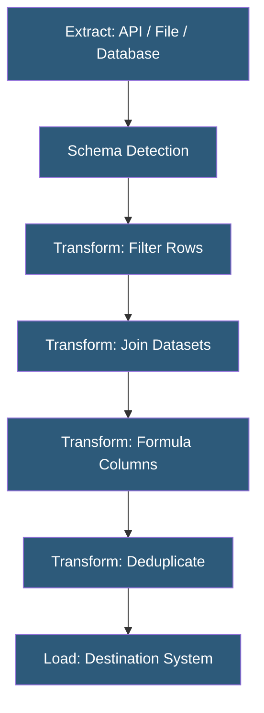

**Category:** Specialized Automation Platforms
**Difficulty:** Intermediate
**Reading time:** 5 min read

---

Parabola's no-code ETL (Extract, Transform, Load) capability enables non-technical teams to build repeatable data pipelines through a visual canvas, replacing manual CSV exports, VLOOKUP-heavy spreadsheets, and one-off data migrations. Its ETL model is purpose-built for operational data workflows rather than large-scale data warehousing, focusing on accessibility and repeatability over throughput.

- **Extract** — pulling raw data from source systems via API, file upload, database query, or direct connector
- **Transform** — visually applying data operations: filters, joins, formulas, deduplication, pivots, and type coercion
- **Load** — writing processed data to a destination system, file, or API endpoint
- **Schema Detection** — Parabola's automatic inference of column names and data types from source data
- **Join Step** — a transformation that merges two data streams on a shared key column (inner, left, right, full outer)
- **Formula Column** — a new column computed from existing columns using spreadsheet-style expressions
- **Pagination Handling** — automatic multi-page API traversal to retrieve complete datasets

Parabola's ETL pipeline begins with extraction: users select a data source from the available connectors. For REST APIs, Parabola handles authentication (API keys, OAuth, basic auth), constructs paginated requests, and flattens nested JSON response structures into tabular rows. For databases, Parabola's connector executes SQL queries and streams results into the canvas.

After extraction, Parabola automatically detects the schema—column names, inferred data types, and a sample of values. This schema drives the UI for subsequent transformation steps, providing column-name autocomplete and type-aware formula suggestions.

Transformation steps are chained on the canvas. The Join step performs relational merges between two data streams, configuring the key column, join type, and which columns to include from each stream. The Formula step uses a spreadsheet-like syntax (similar to Excel/Sheets) for computed columns—parsing dates, concatenating strings, calculating percentages, or applying IF logic.

Loading involves pushing the final transformed data to the destination connector. For append-mode destinations, Parabola tracks run history to provide row-level change tracking. Overwrite mode replaces the entire destination dataset. Parabola can also output multiple formats (CSV, Excel, JSON) to multiple destinations in the same flow.

Error handling surfaces row-level validation failures in the run history—showing which rows failed schema validation or write operations—without stopping the entire pipeline.

- Daily extraction of sales data from Shopify, joining with cost data from a CSV, loading to BigQuery
- Normalizing supplier inventory feeds from multiple FTP CSV formats into a unified schema
- Data migration from a legacy system to a new database via extract-transform-load pipeline
- Scheduled deduplication of a CRM contact list before syncing to email marketing platform
- Building a product catalog from multiple vendor data feeds with normalized attributes

| Advantage | Disadvantage |
|-----------|--------------|
| Visual canvas makes ETL logic auditable by non-developers | Maximum row limits per run restrict very large dataset processing |
| Handles API pagination and authentication complexity | Not designed for streaming/real-time ETL scenarios |
| Schema detection reduces manual column mapping | Complex transformations requiring regex or custom parsing are limited |
| Scheduling and run history built-in without external orchestration | Vendor dependency; migrating pipelines requires rebuilding elsewhere |

- [Parabola Data Workflow Automation](parabola-data-workflow-automation.md)
- [Coefficient Spreadsheet Automation](coefficient-spreadsheet-automation.md)
- [Airtable Scripting](airtable-scripting.md)

---
*Part of the [Specialized Automation Platforms](index.md) category · [Back to Master Index](../../index.md)*
