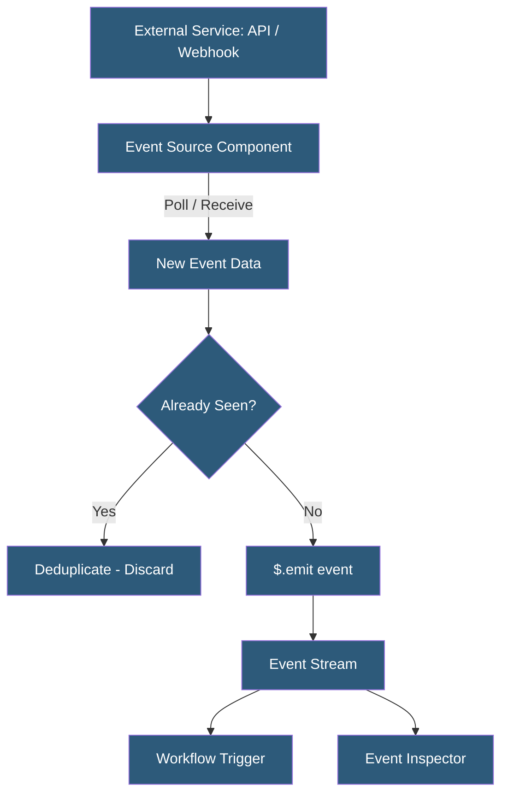

**Category:** Specialized Automation Platforms
**Difficulty:** Intermediate
**Reading time:** 5 min read

---

Pipedream Event Sources are managed components that listen to, poll, and normalize events from external services, emitting them as a stream of standardized events that can trigger workflows. They abstract the complexity of API polling, webhook endpoint management, deduplication, and authentication, giving developers a reliable event feed from any service without building custom listener infrastructure.

- **Event Source** — a Pipedream component that emits events into a stream, serving as a workflow trigger or standalone feed
- **Polling Source** — an event source that calls an external API on a schedule to check for new data
- **Webhook Source** — an event source that receives HTTP callbacks pushed from an external service
- **Deduplication** — the process of filtering out previously-seen events using stored event IDs to prevent duplicate workflow executions
- **Event Store** — Pipedream's managed key-value store where event sources persist state between runs (last-seen timestamps, IDs)
- **Emit** — the action of an event source publishing a new event to its stream via `$.emit()`
- **Event History** — the log of emitted events stored by Pipedream, inspectable for debugging and replay

Event sources run on Pipedream's infrastructure as continuously-operating timers or webhook endpoints. Polling sources execute on a configurable interval (every minute to every 24 hours) and call an external API to check for new events since the last run. The source stores a cursor (last-seen event ID or timestamp) in Pipedream's key-value store, fetches events newer than the cursor, emits new ones, and updates the cursor.

Deduplication is handled by the `$.db` object's `get()`/`set()` methods—the source stores emitted event IDs in a set and skips events it has already processed. This prevents duplicate workflow triggers caused by overlapping API calls or delayed event delivery.

Webhook sources register an HTTPS endpoint with the external service (e.g., registering a webhook URL with GitHub via the GitHub API). When the external service sends a callback, Pipedream receives it, validates any signature (HMAC, shared secret), and emits the payload as an event.

The `$.emit(event, metadata)` function publishes events to the source's stream. Each emitted event has a summary string (used in the event inspector), a unique ID (for deduplication), and a timestamp. Events persist in Pipedream's event history for 30 days by default, and can be replayed to re-trigger workflows.

Multiple workflows can subscribe to the same event source, enabling fan-out: a single GitHub push event source can trigger separate workflows for CI notifications, deployment automation, and documentation updates.

- Polling the Twitter/X API every 15 minutes for mentions of a brand keyword
- Receiving real-time Stripe webhook events and routing to payment processing workflows
- Aggregating events from multiple RSS feeds into a single normalized event stream
- Subscribing a Slack bot workflow and a logging workflow to the same GitHub event source
- Building custom event sources for internal systems that lack webhook support

| Advantage | Disadvantage |
|-----------|--------------|
| Deduplication and state management built-in | Polling sources have minimum 1-minute interval on free plan |
| Webhook management (registration, signature validation) automated | Custom event sources require learning the component spec |
| Fan-out: multiple workflows share one event source | Event history retention limited to 30 days |
| Event inspector allows viewing and replaying past events | Webhook sources require external service to support webhook registration |

- [Pipedream Serverless Workflows](pipedream-serverless-workflows.md)
- [Pipedream Workflow as Code](pipedream-workflow-as-code.md)
- [Airtable Automations](airtable-automations.md)

---
*Part of the [Specialized Automation Platforms](index.md) category · [Back to Master Index](../../index.md)*
