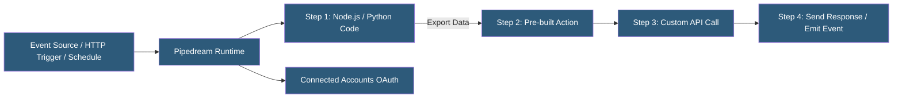

**Category:** Specialized Automation Platforms
**Difficulty:** Intermediate
**Reading time:** 6 min read

---

Pipedream is a serverless workflow automation platform built for developers, offering code-first integrations where every step is either a pre-built component or arbitrary Node.js, Python, Go, or Bash code. It bridges the gap between no-code automation tools and custom-built integrations by making API connections instant while keeping full code control available at every step.

- **Workflow** — a sequence of steps triggered by an event source, executed on Pipedream's serverless infrastructure
- **Trigger** — the event that starts a workflow: HTTP webhook, event source (polling a service), schedule, or email
- **Step** — an individual execution unit: a code step or a pre-built action from the Pipedream component library
- **Event Source** — a Pipedream-managed poller or webhook listener that surfaces events from external services
- **$ (dollar object)** — a special context object available in Node.js steps with methods for emitting data, exporting values, and responding to HTTP
- **Connected Account** — an OAuth-authenticated integration shared across workflows
- **Component** — a reusable, versioned Pipedream action or source published to the public component registry

Pipedream workflows execute on serverless functions running on AWS Lambda-equivalent infrastructure with up to 1GB memory and configurable timeout. Each step in a workflow runs sequentially, with the exported data from each step available to all downstream steps via `steps.step_name.exports`.

Code steps accept full Node.js (with npm package access), Python 3.x, Go, or Bash. The `require()` statement imports any npm package at execution time—Pipedream installs packages on-demand from the npm registry without requiring a build step. This is the most common reason developers choose Pipedream over no-code alternatives.

Event sources are Pipedream-managed components that poll external APIs or listen for webhooks and emit events into a workflow's trigger. For services that don't support webhooks, Pipedream's event sources handle polling, deduplication, and error recovery. Each event source maintains state (the last-seen event ID or timestamp) in Pipedream's key-value store.

Connected Accounts store OAuth tokens for services like Slack, GitHub, Google, Salesforce, and 500+ others. When a pre-built action uses a connected account, Pipedream injects the authentication credentials automatically, and the OAuth refresh cycle is handled by Pipedream's auth infrastructure.

The workflow inspector shows execution logs with per-step timing, exported values, and error traces. Failed steps can be replayed from the inspector with the original event data.

- Receiving GitHub webhook events and routing notifications to Slack or Linear
- Polling a REST API every 5 minutes for new records and syncing to a database
- Transforming webhook payloads with custom Node.js before forwarding to multiple downstream services
- Building lightweight HTTP APIs with Pipedream as the serverless backend
- Connecting services with complex authentication (OAuth, SAML) without managing credential storage

| Advantage | Disadvantage |
|-----------|--------------|
| Full npm package access in Node.js steps | Free tier has execution limits (invocations/month) |
| Multi-language support (Node, Python, Go, Bash) | Workflow canvas less visual than no-code alternatives |
| OAuth handling and token refresh fully managed | Cold starts on infrequently triggered workflows |
| Pre-built components for 500+ services reduce boilerplate | No built-in database; must use external storage |

- [Pipedream Workflow as Code](pipedream-workflow-as-code.md)
- [Pipedream Event Sources](pipedream-event-sources.md)
- [Retool Workflows Automation](retool-workflows-automation.md)

---
*Part of the [Specialized Automation Platforms](index.md) category · [Back to Master Index](../../index.md)*
