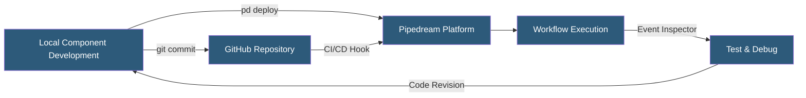

**Category:** Specialized Automation Platforms
**Difficulty:** Advanced
**Reading time:** 6 min read

---

Pipedream's workflow-as-code approach allows developers to define, version-control, and deploy workflows programmatically using the Pipedream CLI and YAML/JSON component definitions. This shifts automation from GUI-only configuration to a Git-friendly, code-reviewable, and CI/CD-deployable artifact, enabling engineering teams to apply software development practices to their integration infrastructure.

- **pd CLI** — Pipedream's command-line interface for deploying workflows, managing sources, and inspecting events
- **Component File** — a JavaScript/TypeScript module following the Pipedream component spec defining a source or action
- **props** — the declared inputs of a component (connected accounts, configuration values, input data)
- **run(event)** — the main function of a component that executes when triggered with the incoming event
- **$.export()** — the function that exposes a step's return value to downstream steps in a workflow
- **Version Control Integration** — the ability to sync workflow changes to a GitHub repository for change tracking
- **Workflow YAML** — a declarative representation of a workflow's steps, triggers, and configurations exportable from the UI

Pipedream components are CommonJS or ES module JavaScript files conforming to the Pipedream component specification. A component defines its `props` (inputs, including connected account references), optional `methods` (helper functions), and the `run(event)` function that executes on each invocation.

The `props` system declarates inputs declaratively: `app` props reference connected accounts and automatically receive authentication credentials at runtime; `string`, `integer`, and `boolean` props create configurable fields in the UI; and `$.interface.http` or `$.interface.timer` props define trigger types. This declarative approach means a single component file defines both the execution logic and the UI configuration form.

The `pd` CLI deploys components directly to Pipedream: `pd deploy component.js` registers and activates the component as a workflow step or event source. The CLI also allows publishing to the public Pipedream component registry, sharing reusable actions with the community.

Workflow configurations can be exported as YAML files containing the trigger definition, ordered step list with component references and prop values, and environment variable bindings. Importing this YAML recreates the workflow exactly, enabling environment promotion (staging to production) and backup/restore workflows.

GitHub Actions can trigger Pipedream deployments by calling the Pipedream REST API, enabling automated deployment pipelines where component code changes in a PR are tested and deployed to staging workflows before merging to main and deploying to production workflows.

- Managing a library of 50+ integration workflows as version-controlled code
- Promoting workflow changes through staging and production environments via CI/CD
- Code-reviewing automation changes with the same GitHub PR process as application code
- Building and publishing reusable component libraries for team standardization
- Automated testing of workflow component logic before deployment

| Advantage | Disadvantage |
|-----------|--------------|
| Git-friendly version control of automation logic | Higher barrier to entry vs. GUI-only tools |
| CI/CD deployable with standard pipeline tooling | Component spec requires learning Pipedream-specific conventions |
| Code review and PR workflow for automation changes | Local testing requires Pipedream account and CLI setup |
| Reusable component publishing benefits team and community | YAML export doesn't capture all workflow nuances perfectly |

- [Pipedream Serverless Workflows](pipedream-serverless-workflows.md)
- [Pipedream Event Sources](pipedream-event-sources.md)
- [Microsoft Power Automate](microsoft-power-automate.md)

---
*Part of the [Specialized Automation Platforms](index.md) category · [Back to Master Index](../../index.md)*
