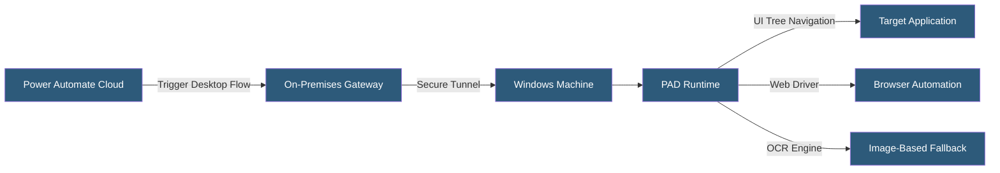

**Category:** Specialized Automation Platforms
**Difficulty:** Intermediate
**Reading time:** 6 min read

---

Power Automate Desktop (PAD) is Microsoft's Robotic Process Automation (RPA) tool that automates Windows desktop applications through UI interaction simulation, enabling organizations to automate tasks in legacy software that lacks APIs. It ships free with Windows 11 and integrates with Power Automate Cloud for hybrid attended and unattended automation scenarios.

- **Attended RPA** — automation running on a user's machine while the user is present, often requiring human interaction at certain points
- **Unattended RPA** — automation running in the background on a machine without user presence, triggered by cloud flows
- **Desktop Flow** — the PAD workflow script that executes automation steps on a Windows machine
- **On-Premises Data Gateway** — the bridge connecting cloud-based Power Automate to local machines for unattended execution
- **UI Element** — a captured reference to a specific control (button, field, window) in a desktop or web application
- **Web Automation** — built-in browser interaction actions using Chromium automation APIs
- **Image-Based Automation** — fallback automation using screen region image matching when UI tree access is unavailable

Power Automate Desktop records and replays UI interactions using the Windows UI Automation (UIA) framework—the accessibility API that exposes every control's properties to assistive technology and automation tools. The PAD recorder captures the automation tree path to each element (window title, class name, control type, and various identifiers) and stores it as a replayable UI element reference.

At execution time, PAD locates the target element by traversing the automation tree using the captured identifiers, then performs the configured action (click, type, select, scrape text). If the primary identifier fails, PAD falls through a configurable priority list of alternative selectors, providing robustness against minor UI changes.

Browser automation uses a separate mechanism: PAD injects a browser extension that exposes the DOM as a structured tree, giving more reliable access to web elements than UI automation. CSS selectors and XPath expressions can target elements precisely, and PAD supports Chrome, Edge, and Firefox.

For truly legacy applications where UI automation is unavailable (terminal emulators, some Citrix environments), PAD uses image recognition—capturing a screenshot template and locating it on screen using fuzzy matching. OCR actions extract text from images or application screens using the Windows OCR engine or Tesseract.

Variables, conditionals, loops, and exception handling in PAD's action library enable building robust, production-grade automation logic. Error handling sub-flows catch and log failures, and retry logic handles transient application states.

- Extracting data from legacy ERP systems with no API into modern databases
- Automating monthly report generation in Excel desktop
- Processing insurance claim forms through legacy claims management software
- Entering bulk data into SAP GUI from structured CSV files
- Scraping data from internal web portals that block programmatic access

| Advantage | Disadvantage |
|-----------|--------------|
| Free with Windows 11 for attended use | Unattended requires Power Automate Per-User Plan license |
| Automates any Windows application without API | Brittle if application UI changes significantly |
| Tight integration with Power Automate Cloud | Debugging recorded flows requires running the application |
| Built-in image recognition and OCR fallback | Performance slower than API-based integration |

- [Microsoft Power Automate](microsoft-power-automate.md)
- [Google Apps Script Automation](google-apps-script-automation.md)
- [Retool Workflows Automation](retool-workflows-automation.md)

---
*Part of the [Specialized Automation Platforms](index.md) category · [Back to Master Index](../../index.md)*
