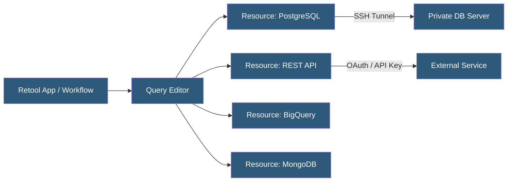

**Category:** Specialized Automation Platforms
**Difficulty:** Intermediate
**Reading time:** 5 min read

---

Retool's database integration layer provides a unified interface for connecting to relational databases, NoSQL stores, data warehouses, and cloud services from within Retool apps and workflows. Resources—the named, reusable connection configurations—abstract connection details and credentials, allowing developers to query any backend using a consistent query editor with auto-complete and schema inspection.

- **Resource** — a named, configured connection to a database or API, shared across all apps in an organization
- **Query** — an operation defined against a resource, executed within an app component or workflow block
- **Resource Environment** — separate resource configurations (staging, production) switchable per deployment
- **Query Library** — a repository of saved, reusable queries that can be called from any app
- **Retool Database** — Retool's built-in managed PostgreSQL database for simple data storage needs
- **SSH Tunneling** — a secure connection method for databases inside private networks via a bastion host
- **Query Transformation** — JavaScript post-processing applied to query results before they reach UI components

Resources are configured once by an admin and then available to all developers in the organization. Connection credentials are stored encrypted in Retool's backend. For databases in private networks, Retool supports SSH tunneling (connecting through a bastion host) and a self-hosted agent that proxies queries from Retool Cloud to on-premises databases without opening inbound firewall rules.

SQL resources (PostgreSQL, MySQL, MSSQL, BigQuery, Snowflake, Redshift) use a SQL query editor with syntax highlighting and schema auto-complete. The schema browser exposes table and column names, helping developers write queries without needing separate database documentation. Query results return as JSON arrays automatically.

REST API resources store the base URL, authentication (API key, OAuth 2.0, Basic Auth, JWT), and default headers. Individual queries define the endpoint path, HTTP method, and body/query parameters. OAuth 2.0 resources handle token refresh automatically.

Query transformations allow post-processing with JavaScript: reshaping nested JSON, filtering results, or computing derived fields before they bind to UI components. This reduces round-trips by handling presentation-layer data shaping at the query level.

Resource environments allow the same resource to point to different endpoints in staging vs. production, controlled by the deployment environment setting. This enables testing apps against staging databases before switching to production connections.

- Building admin panels over PostgreSQL databases with table components auto-wired to queries
- Querying BigQuery analytics data for real-time operational dashboards
- Integrating Stripe API resources to display billing data alongside internal CRM records
- Connecting to MongoDB collections for document-based application backends
- Proxying sensitive database access through Retool's on-premises agent

| Advantage | Disadvantage |
|-----------|--------------|
| Unified query interface across all database types | Resource configuration requires admin access |
| Schema browser reduces context-switching to database tools | SQL queries run client-side in browser for cloud Retool |
| SSH tunneling and on-prem agent for secure private DB access | Query performance depends on database infrastructure |
| OAuth token refresh handled automatically | Complex JOINs across multiple resources require app-level logic |

- [Retool Workflows Automation](retool-workflows-automation.md)
- [Airtable Scripting](airtable-scripting.md)
- [Pipedream Serverless Workflows](pipedream-serverless-workflows.md)

---
*Part of the [Specialized Automation Platforms](index.md) category · [Back to Master Index](../../index.md)*
