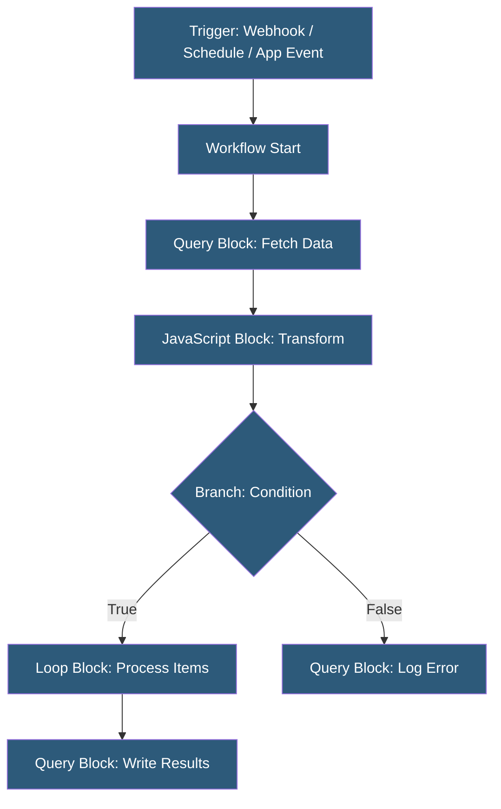

**Category:** Specialized Automation Platforms
**Difficulty:** Intermediate
**Reading time:** 6 min read

---

Retool Workflows is a visual workflow builder integrated into the Retool platform that allows developers and technical users to orchestrate multi-step automation processes combining database queries, API calls, and custom JavaScript logic. Unlike general-purpose automation tools, Retool Workflows is designed for technical teams already using Retool for internal tool development, offering code-first flexibility within a visual canvas.

- **Block** — the fundamental execution unit in a Retool Workflow (query, JavaScript, loop, branch, etc.)
- **Trigger** — what initiates a workflow: webhook, schedule, Retool app action, or manual run
- **Resource** — a pre-configured connection to a database, API, or service shared across Retool apps and workflows
- **JavaScript Block** — a code block for custom transformation logic between query steps
- **Loop Block** — iterates over an array, executing a sub-workflow for each item
- **Branch Block** — conditionally routes workflow execution based on a JavaScript expression
- **Run History** — execution logs with input/output per block, enabling debugging of failed runs

Retool Workflows execute on Retool's cloud infrastructure (or self-hosted Retool for enterprise). Each workflow is defined as a directed acyclic graph of blocks on a visual canvas, with data flowing between blocks via explicit connections.

Query blocks use Retool's resource system—the same data source connections configured for Retool apps. SQL databases (PostgreSQL, MySQL, BigQuery), REST APIs, GraphQL endpoints, and services like Stripe, Twilio, and SendGrid can all be queried using the same interface. Query blocks return typed results that downstream blocks reference via JavaScript expressions (`{{ block_name.data }}`).

JavaScript blocks accept arbitrary Node.js-compatible code with access to all upstream block outputs through the `{{}}` interpolation syntax. Common uses include data transformation, validation logic, and preparing payloads for subsequent API calls. These blocks support async/await for external API calls when needed.

Loop blocks solve the fan-out problem: processing a list of items returned by a previous query by executing a contained sub-workflow for each element. The loop handles concurrency configuration, allowing sequential or parallel execution with a configurable concurrency limit.

Webhook triggers provide an HTTPS endpoint that can receive POST payloads, enabling external systems (GitHub webhooks, Stripe events, Salesforce outbound messages) to initiate Retool Workflows. Schedule triggers use a cron expression for time-based execution.

Integration with Retool apps is bidirectional: apps can trigger workflows via button actions, and workflows can be configured to write results back to app-level state.

- Syncing customer records between PostgreSQL and Salesforce on a schedule
- Processing webhook events from Stripe and updating internal billing database
- Batch operations: processing thousands of records with controlled concurrency
- Multi-step approval workflows with conditional branching and email notifications
- ETL pipelines from raw API data to structured database tables

| Advantage | Disadvantage |
|-----------|--------------|
| Shares data source connections with Retool apps | Requires Retool subscription; not standalone |
| Code-first JavaScript blocks for complex logic | Canvas-based workflows become complex at large scale |
| Detailed run history with per-block debugging | Not suitable for consumer-facing workflows |
| Loop block handles batch processing natively | Less extensive connector library vs. Zapier/Make |

- [Retool Database Integrations](retool-database-integrations.md)
- [Pipedream Serverless Workflows](pipedream-serverless-workflows.md)
- [Airtable Automations](airtable-automations.md)

---
*Part of the [Specialized Automation Platforms](index.md) category · [Back to Master Index](../../index.md)*
