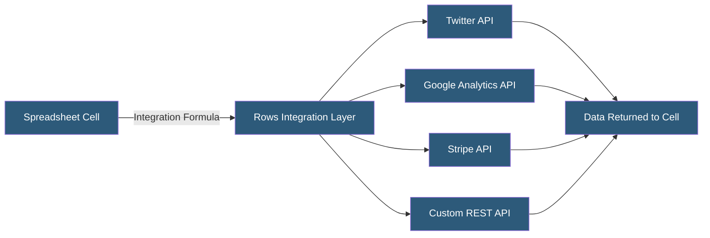

**Category:** Specialized Automation Platforms
**Difficulty:** Beginner
**Reading time:** 5 min read

---

Rows is a modern spreadsheet tool that embeds native integrations directly into spreadsheet formulas, allowing users to call APIs, query databases, and interact with SaaS services using spreadsheet functions rather than building separate automation workflows. It combines the familiarity of spreadsheet formulas with the power of a platform integration hub.

- **Integration Formula** — a spreadsheet function that calls an external service (e.g., `=TWITTER.SEARCH("keyword")`)
- **Source** — a connected data provider (Twitter, Google Analytics, Stripe, SQL databases, REST APIs)
- **Input** — an interactive cell element (dropdowns, buttons, sliders) that lets users trigger actions or filter data
- **Send Email** — a built-in action that sends emails triggered from button clicks in the spreadsheet
- **Publish** — converting a Rows spreadsheet into a shareable web app or embedded dashboard
- **Automation** — a scheduled or event-triggered refresh of formula-driven data in the spreadsheet
- **REST API Source** — a configured custom API connection defining authentication and endpoints

Rows extends the traditional spreadsheet formula paradigm with integration functions that call external APIs and return structured data directly into cells. When a user enters an integration formula, Rows executes an authenticated API call using stored credentials and writes the response data as a table of values starting at that cell—similar to how array formulas work in Excel or Sheets.

Authentication for integrations is handled at the source level: users connect their accounts once via OAuth or API key, and all integration formulas automatically use those credentials. The integration layer manages rate limiting, pagination, and error handling transparently.

Interactive input elements—dropdown menus, date pickers, toggle buttons, and sliders—can be inserted into cells and bound to formula parameters, turning the spreadsheet into a dynamic data explorer. Clicking a button triggers configured actions: sending an email, calling an API endpoint, or refreshing data.

The Publish feature transforms a Rows spreadsheet into a shareable URL accessible by non-Rows users, rendered as a clean web application. Published spreadsheets can be interactive (with input controls) or read-only dashboards, enabling data sharing without requiring recipients to have Rows accounts.

Automations schedule formula refreshes or trigger them on specific conditions, keeping integration data current. For reporting use cases, this means a Rows spreadsheet refreshes itself and emails a PDF snapshot to stakeholders automatically.

- Social media analytics dashboards pulling Twitter, LinkedIn, and YouTube data via integration formulas
- E-commerce reporting combining Stripe and Shopify data in a single spreadsheet
- Competitive analysis tools refreshing web data on a schedule
- Interactive data exploration tools published as web apps for executives
- API testing and exploration using integration formulas as a visual REST client

| Advantage | Disadvantage |
|-----------|--------------|
| Integration formulas feel native to spreadsheet users | Integration function coverage varies; not all APIs available |
| No separate automation platform required | Not suitable for complex multi-step workflow orchestration |
| Publish feature creates shareable web apps instantly | Performance depends on underlying API response times |
| Button actions enable simple interactive workflows | Less powerful for data transformation than dedicated ETL tools |

- [Coefficient Spreadsheet Automation](coefficient-spreadsheet-automation.md)
- [Actiondesk Spreadsheet Automation](actiondesk-spreadsheet-automation.md)
- [Google Apps Script Automation](google-apps-script-automation.md)

---
*Part of the [Specialized Automation Platforms](index.md) category · [Back to Master Index](../../index.md)*
