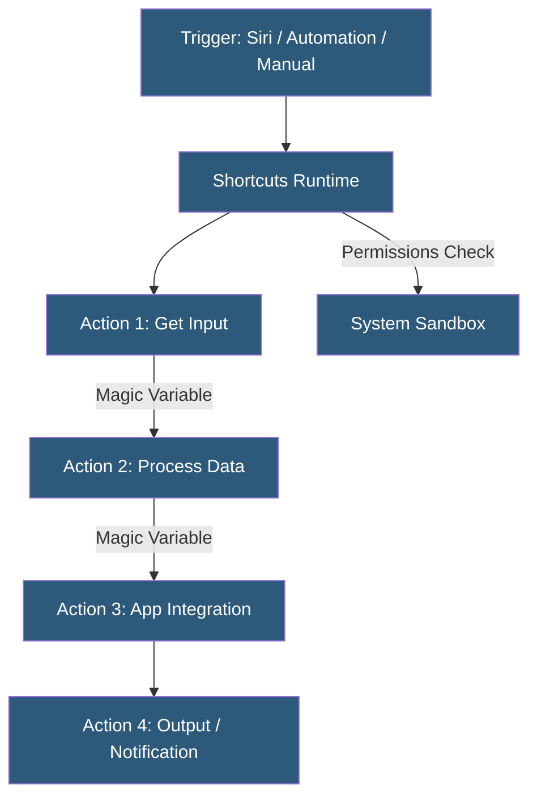

**Category:** Specialized Automation Platforms
**Difficulty:** Beginner
**Reading time:** 6 min read

---

Apple Shortcuts is a visual automation app built into iOS, iPadOS, and macOS that allows users to create multi-step workflows combining actions from Apple's operating system, built-in apps, and third-party integrations. It replaced the Workflow app after Apple acquired it in 2017 and has grown into a full automation environment with scripting capabilities, system integrations, and Siri trigger support.

- **Action** — a single automation step drawn from the OS, an app, or a web API
- **Shortcut** — a saved sequence of actions that executes as a single unit
- **Parameter** — a configurable input value for an action that can be static or dynamically provided
- **Magic Variables** — automatically created variables representing the output of each preceding action
- **Automation Trigger** — a system event (time, location, app open, NFC tag) that runs a shortcut automatically
- **Siri Integration** — the ability to invoke any shortcut by voice using a custom phrase
- **App Intents** — the modern API framework (iOS 16+) app developers use to expose actions to Shortcuts

Shortcuts operates within Apple's sandboxed environment, executing actions sequentially with data flowing between steps via Magic Variables. Each action receives an implicit input (the output of the previous action) plus any explicitly configured parameters, producing an output that downstream actions can consume.

The App Intents framework (introduced iOS 16) is the modern mechanism by which third-party apps expose their functionality to Shortcuts. Developers define intent types in Swift, specifying parameters, return types, and suggested phrases. This replaced the older SiriKit extension model and allows much deeper, type-safe integrations.

Automation triggers run shortcuts without user intervention based on system events: time of day, location entering/leaving, when a specific app opens, when AirPods connect, when charging begins, or when an NFC tag is scanned. Personal automations require confirmation by default; some require "Allow" to run silently.

On macOS, Shortcuts gains access to shell scripts (Run Shell Script action), AppleScript, and Automator actions, making it a bridge between visual automation and system-level scripting. Shortcuts can also call web APIs directly using the "Get Contents of URL" action, supporting GET, POST, PUT, and DELETE with custom headers and JSON bodies.

iCloud sync ensures shortcuts are available across all Apple devices, and the Shortcuts Gallery allows sharing via links. The scripting layer—including conditionals, loops, variables, and dictionaries—gives power users Python-like logical flow within a visual interface.

- Morning routine shortcuts combining alarm dismissal, weather check, and calendar summary
- Text transformation shortcuts triggered from the Share Sheet in any app
- Home automation triggered by location (arriving home, leaving office)
- Automated photo resizing and watermarking via the Files app
- Web API calls to log data to Airtable or Notion on a schedule

| Advantage | Disadvantage |
|-----------|--------------|
| Deep OS integration on Apple devices | iOS-only; no Android or Windows support |
| No server required; runs entirely on-device | Complex shortcuts become unwieldy visually |
| Siri voice activation built-in | Background automation requires device to be on |
| Free and pre-installed on all Apple devices | App Intents coverage varies by third-party developer |

- [Shortcuts App Actions](shortcuts-app-actions.md)
- [IFTTT Consumer Automation](ifttt-consumer-automation.md)
- [Microsoft Power Automate](microsoft-power-automate.md)

---
*Part of the [Specialized Automation Platforms](index.md) category · [Back to Master Index](../../index.md)*
