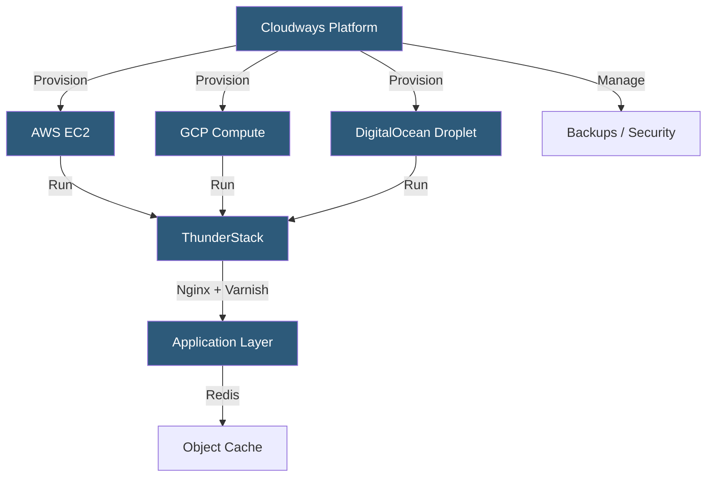

**Category:** Specialized Hosting Services
**Difficulty:** Intermediate
**Reading time:** 6 min read

---

Cloudways is a managed cloud hosting platform that provisions servers on AWS, Google Cloud, DigitalOcean, Linode, or Vultr through a unified interface, handling server-level management tasks (OS updates, security patching, backups) while giving developers access to configurable PHP, MySQL, and Nginx/Apache stacks.

- **Cloud Provider Choice** — Selection of underlying infrastructure provider (AWS, GCP, DigitalOcean, Linode, Vultr)
- **Application** — Cloudways' term for a web application (WordPress, Magento, PHP app) hosted on a server
- **Server** — The underlying cloud VM provisioned through the chosen provider
- **ThunderStack** — Cloudways' name for their performance stack combining Nginx, Varnish, Memcached, and Redis
- **SafeUpdates** — Automated plugin update testing with visual regression (analogous to WP Engine SPM)
- **Team Collaboration** — Multi-user access with role-based permissions for agencies
- **Cloudways CDN** — An optional Cloudflare Enterprise-powered CDN add-on

Cloudways operates as an infrastructure abstraction layer — it holds cloud provider accounts and provisions VMs on behalf of customers. When creating a server, the user selects a provider, region, and machine size, and Cloudways provisions the VM and installs its management stack within minutes.

The ThunderStack configures the server with Nginx as the primary web server, Apache optionally behind Nginx as a proxy for .htaccess compatibility, Varnish as a full-page cache layer, Redis for object caching, and Memcached as an alternative key-value cache. PHP-FPM versions are switchable per application from the dashboard without server restarts.

Each application on the server is isolated in its own directory with a separate PHP-FPM pool, database user, and document root. Multiple applications can share a single server VM for cost efficiency, or dedicated servers can host a single large application.

Cloudways handles automated server-level tasks: OS security patches applied automatically, daily backups to remote storage, firewall management, and SSL certificate provisioning via Let's Encrypt. Database access is through phpMyAdmin or SSH tunneling.

Vertical scaling (resizing the underlying VM) is supported through the dashboard — though it requires a brief server restart. Horizontal scaling (adding more servers behind a load balancer) requires manual configuration outside Cloudways.

- Agencies wanting managed hosting flexibility without managing raw cloud VMs
- WordPress/WooCommerce sites needing custom PHP configuration not available on fully managed platforms
- Teams wanting to choose their cloud provider for data residency compliance
- Cost-conscious teams hosting multiple sites on a single optimized server
- Sites migrating from cPanel hosts wanting a modern managed interface

| Advantage | Disadvantage |
|-----------|--------------|
| Choice of five underlying cloud providers | Manual server sizing and vertical scaling requires downtime |
| Managed OS security and backups | No horizontal auto-scaling built in |
| PHP version flexibility per application | Support response times slower than dedicated managed hosts |
| More configurable than fully managed WordPress hosts | Cloudways markup over raw cloud provider pricing |

- [Cloudways Team Collaboration](cloudways-team-collaboration.md)
- [Cloudways Staging Environments](cloudways-staging-environments.md)
- [Kinsta WordPress Hosting](kinsta-wordpress-hosting.md)

---
*Part of the [Specialized Hosting Services](index.md) category · [Back to Master Index](../../index.md)*
