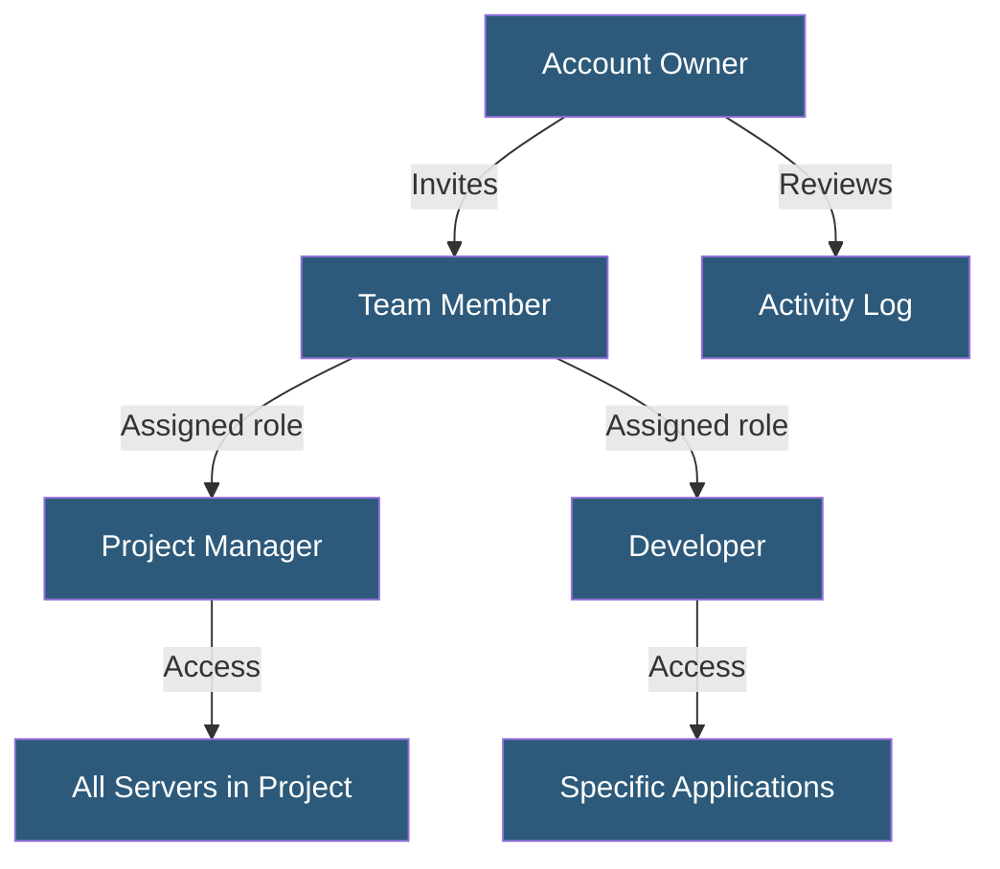

**Category:** Specialized Hosting Services
**Difficulty:** Beginner
**Reading time:** 5 min read

---

Cloudways Team Collaboration enables multiple users to access and manage servers and applications under a single account with role-based permissions, allowing agencies and development teams to delegate specific hosting management responsibilities without sharing account credentials.

- **Team Member** — A user invited to access the Cloudways account with defined permissions
- **Role** — A permission preset (Account Owner, Developer, Project Manager) controlling access scope
- **Project** — A logical grouping of servers and applications for organized team access
- **Permission Scope** — Server-level or application-level access control per team member
- **Invite** — An email-based onboarding flow for adding new team members
- **Activity Log** — A record of actions performed by each team member for audit purposes
- **SSH Key Management** — Per-user SSH key registration for server terminal access

The Cloudways account owner invites team members via email from the Team Management section of the dashboard. Each invitation specifies the role assigned to that member. Roles control which sections of the Cloudways platform the member can view and modify.

Project Managers receive access to server management functions including server scaling, backup configuration, and security settings, but not billing or account-level settings. Developers get application-level access — deploying code, managing staging environments, configuring application settings — without access to server infrastructure controls.

Custom roles extend beyond the preset options, allowing granular permission assignments: a team member might be granted access to only specific servers within the account, or to specific applications on a server. This prevents developers from accidentally modifying production server configurations when only staging access is needed.

SSH key management allows each team member to register their own public SSH key, which Cloudways adds to the server's authorized_keys file. Individual keys can be revoked without affecting other team members' access, and key usage is logged in the activity audit trail.

The activity log records all significant actions — server creation, application deployment, staging pushes, backup restores — with timestamps and the team member who performed each action. This supports post-incident review and compliance documentation.

- Agencies giving clients read-only access to their own server metrics
- Development teams separating developer access from infrastructure management
- Onboarding contractors with scoped application access for specific client projects
- Auditing which team member performed a production change
- Revoking access immediately when a team member leaves the organization

| Advantage | Disadvantage |
|-----------|--------------|
| Granular permission scope per team member | Role customization requires manual configuration |
| SSH key management per user with individual revocation | Team member limits on lower Cloudways plans |
| Activity log provides audit trail | Log retention period limited |
| No credential sharing required | Does not integrate with SSO/SAML identity providers |

- [Cloudways Managed Cloud Hosting](cloudways-managed-cloud-hosting.md)
- [Cloudways Staging Environments](cloudways-staging-environments.md)
- [Cloudways Vertical Scaling](cloudways-vertical-scaling.md)

---
*Part of the [Specialized Hosting Services](index.md) category · [Back to Master Index](../../index.md)*
